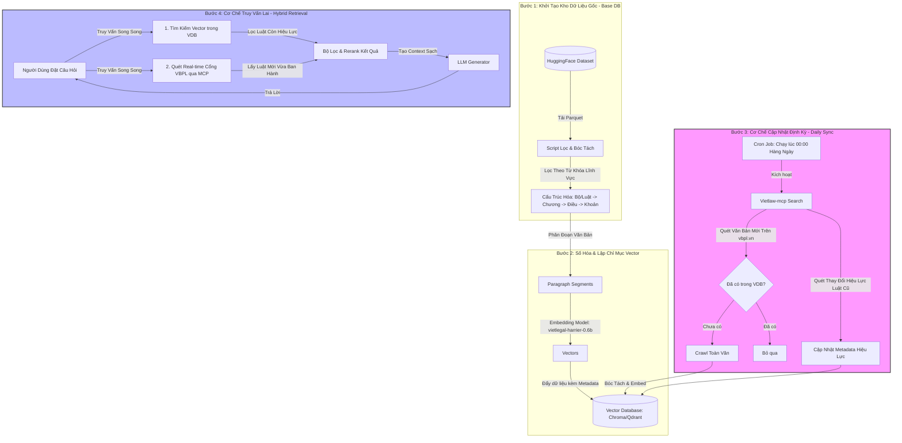
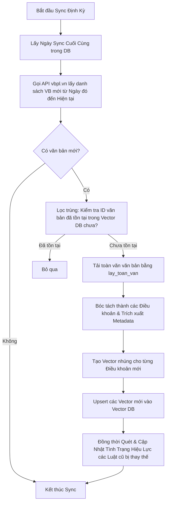

# Kế Hoạch Xây Dựng Kho Dữ Liệu Pháp Luật Chuẩn & Cơ Chế Cập Nhật Tự Động Cho Chatbot RAG

Tài liệu này trình bày chi tiết kế hoạch thiết lập kho dữ liệu pháp luật Việt Nam chất lượng cao (Base Knowledge Base) và cơ chế cập nhật tự động (Incremental Update) nhằm phục vụ cho hệ thống Chatbot RAG (Retrieval-Augmented Generation). 

Hệ thống được thiết kế dựa trên sự kết hợp giữa **Dữ liệu nền tảng đã đóng gói sẵn** và **Cập nhật thời gian thực từ nguồn gốc Chính phủ**.

---

## 🗺️ Sơ Đồ Kiến Trúc Hệ Thống Dữ Liệu (Data Pipeline)



---

## 📌 PHẦN I: XÂY DỰNG KHO DỮ LIỆU NỀN TẢNG (BOOTSTRAP BASE DATA)

Để tránh việc cào quét hàng triệu trang web pháp luật từ đầu (gây tốn thời gian, dễ bị chặn IP), chúng ta sẽ tận dụng tập dữ liệu được đóng gói sẵn của cộng đồng và tiến hành chuẩn hóa.

### 1. Thu Thập Dữ Liệu Gốc (Raw Data Harvesting)
*   **Nguồn dữ liệu:** Tập dữ liệu Parquet từ HuggingFace `th1nhng0/vietnamese-legal-documents`.
*   **Kế hoạch thực hiện:**
    *   Sử dụng script Python [01_download_data.py](file:///Users/tonguyen/Library/CloudStorage/OneDrive-Personal/DrTo/VN%20LAW/01_download_data.py) để tải 3 tệp dữ liệu chính:
        *   `metadata.parquet`: Thông tin số hiệu, tiêu đề, ngày ban hành, cơ quan ban hành, lĩnh vực, tình trạng hiệu lực.
        *   `content.parquet` (~3.5 GB): Toàn văn nội dung dưới dạng HTML sạch.
        *   `relationships.parquet`: Mối quan hệ giữa các văn bản (sửa đổi, bổ sung, thay thế, hướng dẫn).

### 2. Lọc Dữ Liệu Mục Tiêu (Domain Filtering)
Hệ thống chatbot cần tập trung vào các lĩnh vực pháp lý cụ thể của anh để tối ưu hóa không gian tìm kiếm và tăng độ chính xác:
*   **Bộ lọc lĩnh vực:** Lọc theo các từ khóa trong tiêu đề hoặc metadata lĩnh vực (Ví dụ: Hình sự, Dân sự, Đất đai, Thuế, Doanh nghiệp).
*   **Bộ lọc hiệu lực:** Ưu tiên giữ lại các văn bản có trạng thái hiệu lực là `Còn hiệu lực` hoặc `Chưa có hiệu lực` (sắp áp dụng). Gắn nhãn rõ ràng cho các văn bản `Hết hiệu lực một phần` hoặc `Hết hiệu lực toàn bộ`.

### 3. Cấu Trúc Hóa Dữ Liệu (Data Chunking & Structuring)
RAG hoạt động tốt nhất khi dữ liệu được chia nhỏ thành các đoạn có nghĩa (semantically meaningful chunks) thay vì nạp cả văn bản dài hàng trăm trang.
*   **Nguyên tắc chia nhỏ (Chunking Strategy):**
    *   **Không** chia nhỏ theo số lượng ký tự tùy ý (tránh làm mất ngữ cảnh của điều luật).
    *   **Bắt buộc** chia nhỏ theo **Đơn vị Điều khoản** (Điều 1, Điều 2...). Mỗi "Điều" là một đoạn thông tin độc lập (Document Chunk).
    *   **Đoạn trích (Chunk Content)** sẽ bao gồm:
        ```text
        [Tên Văn Bản] - [Số Hiệu]
        [Chương...] - [Mục...]
        [Điều...]: [Nội dung chi tiết của điều luật bao gồm các khoản a, b, c]
        ```
*   **Trích xuất Metadata kèm theo mỗi Chunk:**
    *   `id`: Mã định danh duy nhất của điều khoản (`so_hieu_van_ban#dieu_so`).
    *   `so_hieu`: Số hiệu văn bản (Ví dụ: `91/2015/QH13`).
    *   `title`: Tiêu đề đầy đủ của văn bản.
    *   `loai_van_ban`: Luật, Nghị định, Thông tư, Án lệ...
    *   `ngay_ban_hanh` & `ngay_hieu_luc`.
    *   `tinh_trang`: Tình trạng hiệu lực (Ví dụ: `Còn hiệu lực`).

---

## 📌 PHẦN II: LẬP CHỈ MỤC VECTOR (VECTOR INDEXING)

Sau khi dữ liệu đã được làm sạch và chia nhỏ, hệ thống sẽ số hóa các đoạn luật thành không gian Vector để chatbot có thể tìm kiếm theo ý nghĩa câu hỏi của người dùng.

### 1. Mô Hình Nhúng Chuyên Dụng (Embedding Model)
*   **Lựa chọn:** **`mainguyen9/vietlegal-harrier-0.6b`** (Model Sentence Transformer được tinh chỉnh chuyên biệt cho ngôn ngữ pháp lý Việt Nam).
*   **Ưu điểm:** Khác với các model đa ngôn ngữ thông thường (như Cohere hay OpenAI), model này hiểu sâu sắc các thuật ngữ pháp lý đặc thù của Việt Nam (Ví dụ: phân biệt được sự khác nhau ngữ nghĩa giữa "khởi tố", "truy tố", "xét xử").

### 2. Cơ Sở Dữ Liệu Vector (Vector Database)
*   **Lựa chọn khuyến nghị:** **Qdrant** hoặc **ChromaDB** (Cho môi trường phát triển nhanh/local) hoặc **Pgvector** (Tích hợp trực tiếp vào PostgreSQL nếu hệ thống chatbot dùng Postgres làm DB chính).
*   **Cấu trúc lưu trữ:** Mỗi bản ghi (Point/Document) lưu trữ:
    *   **Vector:** Kết quả đầu ra từ model nhúng (kích thước vector chuẩn của model).
    *   **Payload (Metadata):** Các trường thông tin đã trích xuất ở Phần I phục vụ cho việc lọc (Filtering) khi tìm kiếm.

---

## 📌 PHẦN III: CƠ CHẾ CẬP NHẬT GIA TĂNG TỰ ĐỘNG (INCREMENTAL UPDATE PIPELINE)

Để chatbot luôn cập nhật các luật mới ban hành mà không cần tải lại toàn bộ cơ sở dữ liệu cũ, chúng ta thiết lập một đường ống cập nhật gia tăng tự động.

### 1. Trình Quét Định Kỳ (Incremental Sync Engine)
*   **Công cụ sử dụng:** Tận dụng công cụ `tim_van_ban` và `lay_toan_van` trong dự án [Vietlaw-mcp](file:///Users/tonguyen/Library/CloudStorage/OneDrive-Personal/DrTo/Vietlaw-mcp).
*   **Tác vụ Scheduler (Cron Job):** Cấu hình chạy lúc **00:00 hàng ngày** bằng câu lệnh:
    ```bash
    0 0 * * * /usr/bin/python3 /path/to/project/sync_new_laws.py >> /path/to/project/logs/sync.log 2>&1
    ```

### 2. Quy Trình Cập Nhật Gia Tăng (Step-by-Step Update Workflow)



### 3. Đồng Bộ Trạng Thái Hiệu Lực (Tránh Tư Vấn Luật Hết Hạn)
Khi một Luật hoặc Nghị định mới được ban hành, nó thường sẽ thay thế các văn bản cũ. 
*   **Hành động:** Khi quét thấy văn bản mới có thông tin thay thế (Ví dụ: *"Nghị định này thay thế Nghị định số 43/2014/NĐ-CP"*), script cập nhật sẽ tự động tìm kiếm các bản ghi có số hiệu `43/2014/NĐ-CP` trong Vector DB và chuyển trạng thái hiệu lực (`tinh_trang`) thành `Hết hiệu lực`.

---

## 📌 PHẦN IV: CƠ CHẾ TRUY VẤN LAI THỜI GIAN THỰC (HYBRID RETRIEVAL FOR CHATBOT)

Để đảm bảo an toàn tuyệt đối trước những thay đổi luật pháp diễn ra trong ngày, chatbot sẽ áp dụng cơ chế truy vấn thông minh kết hợp giữa Offline Vector DB và Real-time Online Search.

### 1. Phân Tích Ý Định Tìm Kiếm (Intent Classification)
Khi người dùng nhập câu hỏi vào chatbot, LLM sẽ phân tích nhanh xem người dùng có đang muốn tìm luật mới nhất hoặc văn bản cụ thể hay không (Ví dụ: *"Nghị định mới nhất về..."*, *"Quyết định vừa ra của Thủ tướng..."*).

### 2. Truy Vấn Song Song (Parallel Execution)
*   **Luồng A (Offline Vector Search):**
    *   Hệ thống thực hiện tìm kiếm tương đồng vector trong Vector DB.
    *   **Quan trọng:** Áp dụng bộ lọc siêu dữ liệu chỉ lấy các bản ghi có `tinh_trang = "Còn hiệu lực"` hoặc `tinh_trang = "Chưa có hiệu lực"`.
*   **Luồng B (Online Real-time Search):**
    *   Hệ thống gọi công cụ tìm kiếm của `Vietlaw-mcp` lên trực tiếp trang `vbpl.vn` theo từ khóa ngữ nghĩa của câu hỏi để lấy thông tin các văn bản vừa được ban hành gần nhất.
    *   Nếu phát hiện văn bản mới chưa có trong hệ thống Vector DB, hệ thống sẽ thực hiện bóc tách nhanh (on-the-fly) văn bản đó để đưa vào ngữ cảnh câu trả lời.

### 3. Reranking & Tạo Ngữ Cảnh Sạch (Context Generation)
*   Hệ thống gộp kết quả từ Luồng A và Luồng B.
*   Loại bỏ trùng lặp nếu có.
*   Sắp xếp thứ tự ưu tiên (ưu tiên các văn bản có hiệu lực pháp lý cao hơn và ngày ban hành mới hơn).
*   Đóng gói ngữ cảnh và gửi tới LLM để sinh câu trả lời cho người dùng kèm nguồn trích dẫn rõ ràng (số hiệu, ngày ban hành, điều khoản cụ thể).

---

## 📅 KẾ HOẠCH HÀNH ĐỘNG & CÁC BƯỚC TRIỂN KHAI

Để hiện thực hóa kế hoạch này, dưới đây là các bước hành động cụ thể anh có thể triển khai tuần tự:

| Bước | Nội Dung Thực Hiện | Công Cụ/Dự Án Sử Dụng | Kết Quả Đầu Ra |
|---|---|---|---|
| **Bước 1** | Tải và lọc dữ liệu cơ sở từ HuggingFace | `VN LAW/01_download_data.py` | Tệp dữ liệu nền tảng sạch dạng JSON lưu tại máy. |
| **Bước 2** | Thiết lập Vector DB và chạy lập chỉ mục ban đầu | `VN LAW/03_build_index.py` + `Qdrant/Chroma` | Cơ sở dữ liệu Vector DB chứa đầy đủ tri thức pháp luật nền tảng. |
| **Bước 3** | Viết Script tự động hóa việc cập nhật hàng ngày | Kết hợp `Vietlaw-mcp` + API `vbpl.vn` | File script Python `sync_new_laws.py` chạy độc lập. |
| **Bước 4** | Thiết lập Cron Job chạy ngầm định kỳ | Hệ điều hành (Linux/macOS Crontab) | Hệ thống tự động cập nhật kiến thức mỗi đêm. |
| **Bước 5** | Tích hợp cơ chế truy vấn lai vào Backend Chatbot | Backend Node.js / Python của Chatbot | Chatbot trả lời siêu tốc, thông minh và luôn luôn đúng luật mới nhất. |
