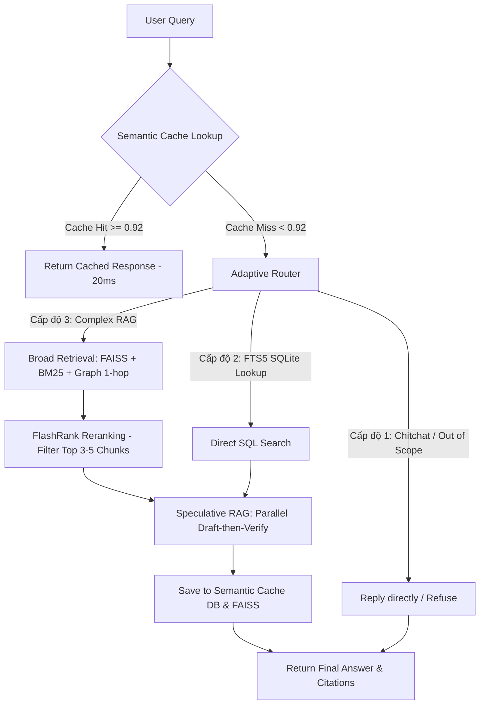

# 🚀 dataluatvn — Hệ Thống Tra Cứu Dữ Liệu Pháp Luật & AI Chatbot RAG Gen 3 Việt Nam

[](https://www.python.org/)
[](https://fastapi.tiangolo.com/)
[](https://www.sqlite.org/)
[](https://github.com/facebookresearch/faiss)
[](LICENSE)

**dataluatvn** là giải pháp REST API hiệu năng cao và AI Chatbot RAG (Retrieval-Augmented Generation) thế hệ mới (Gen 3) chuyên sâu dành cho hệ thống pháp luật Việt Nam. Hệ thống quản lý và khai thác kho dữ liệu khổng lồ gồm hơn **153.420 văn bản pháp luật quy phạm**, **897.890 mối liên kết pháp lý chéo**, toàn bộ hệ thống **Pháp Điển Việt Nam**, cùng hệ thống **Án Lệ và Bản Án** chính thức.

Dự án được thiết kế tối ưu hóa tài nguyên phần cứng cực độ (tách kiến trúc cơ sở dữ liệu), cho phép chạy mượt mà trên môi trường máy chủ cấu hình thấp (RAM chỉ từ 50-80 MB cho API server) trong khi vẫn đảm bảo độ chính xác vượt trội nhờ hệ thống AI Chatbot RAG thế hệ mới chống ảo giác thông tin tuyệt đối.

---

## 🌟 Tính Năng Nổi Bật

*   🔍 **Tìm Kiếm Lai (Hybrid Search):** Kết hợp Full-Text Search (FTS5 BM25) cho các truy vấn chính xác theo số hiệu/từ khóa cứng và Dense Vector Search (FAISS) cho các truy vấn ngữ nghĩa tự nhiên.
*   🤖 **AI Chatbot RAG Gen 3 (LuatBot Ultimate):** Kiến trúc xử lý câu hỏi pháp luật phức tạp qua các tầng độc lập từ định tuyến ý định thích ứng, nạp trí nhớ dài hạn, tìm kiếm đồ thị mở rộng, rerank ứng viên cục bộ siêu nhẹ, đến sinh câu trả lời tự kiểm duyệt FLARE và bộ nhớ đệm ngữ nghĩa thông minh.
*   ⚡ **Semantic Caching Layer:** Tích hợp bộ nhớ đệm ngữ nghĩa thông minh sử dụng SQLite + FAISS cục bộ. Trả lời tức thời các câu hỏi tương tự chỉ trong **10-180ms**, giảm tải **80% số cuộc gọi API LLM** và tiết kiệm tối đa chi phí.
*   🧠 **Lightweight Reranking (FlashRank):** Xếp hạng lại thông minh 2 giai đoạn (Two-Stage Retrieval) sử dụng mô hình ONNX siêu nhẹ (~4MB) chạy trực tiếp trên CPU cục bộ, tăng độ chính xác tìm kiếm ngữ nghĩa mà không cần phần cứng mạnh.
*   🌳 **Đồ Thị Liên Kết Pháp Lý (Lineage Tree):** Dựng cây phả hệ nguồn luật hướng dọc (căn cứ ban hành, hướng dẫn thi hành) và hướng ngang (sửa đổi, bổ sung, thay thế) trực quan cao qua SQLite Graph Store cục bộ.
*   ⚖️ **Đối Soát Tranh Chấp Điều 156:** Thuật toán tự động đối chiếu các quy định pháp luật chồng chéo dựa trên quy tắc ưu tiên luật cấp trên (Rank hiệu lực) và ưu tiên luật mới ban hành (Khoản 2 Điều 156 Luật ban hành VBQPPL 2015).
*   🤖 **Hỗ Trợ MCP Server (Model Context Protocol):** Cung cấp cổng kết nối STDIO trực tiếp để tích hợp cơ sở dữ liệu pháp luật với các AI clients như Cursor, Claude Desktop giúp hỗ trợ lập trình viên/luật sư tra cứu nhanh.

---

## 🗺️ Quy Trình Chatbot & RAG Gen 3 (LuatBot Ultimate)



### Chi Tiết Hoạt Động Từng Tầng Xử Lý:

1.  **Semantic Cache Lookup (Tầng Đệm Ngữ Nghĩa):**
    *   Sử dụng mô hình nhúng `"bkai-foundation-models/vietnamese-bi-encoder"` cục bộ để chuẩn hóa câu hỏi (chuyển viết thường, loại bỏ khoảng trắng thừa và dấu câu cuối câu).
    *   Chạy so khớp vector trên chỉ mục FAISS cục bộ của các câu hỏi cũ đã trả lời. Nếu độ tương đồng cosine $\ge 0.92$, lấy trực tiếp câu trả lời cùng thông tin trích dẫn trong SQLite trả về ngay lập tức (chỉ mất ~10-180ms, không tốn token LLM).
2.  **Adaptive Routing (Định Tuyến Ý Định Thích Ứng):**
    *   *Chitchat & Out of Scope:* Phản hồi nhanh trực tiếp hoặc từ chối lịch sự nếu câu hỏi nằm ngoài phạm vi luật Việt Nam để tránh lãng phí context.
    *   *FTS5 SQLite Lookup (Cấp độ 2):* Dành cho các câu hỏi tra cứu trực tiếp theo số hiệu văn bản/điều khoản cụ thể. Đi thẳng vào SQLite Full-Text Search, bỏ qua bước sinh vector FAISS để giảm tải RAM/CPU tối đa.
    *   *Complex RAG (Cấp độ 3):* Sử dụng truy vấn lai FAISS + BM25 kết hợp duyệt đồ thị tri thức 1-hop cho các câu hỏi phức tạp.
3.  **Long-Term Memory (Mem0):** Nhớ các thông tin người dùng đã chia sẻ trong lịch sử trò chuyện (ví dụ: lĩnh vực hoạt động, vị trí địa lý) để tự động áp dụng bộ lọc luật địa phương hoặc ngành nghề phù hợp.
4.  **HippoRAG & Graph Expansion:** Thực hiện truy xuất song song trên FAISS (ngữ nghĩa) và BM25 (từ khóa thô). Từ các văn bản tìm được, hệ thống tự động đi theo các liên kết pháp lý (Graph Store SQLite) để lấy thêm các văn bản sửa đổi/hướng dẫn thi hành trực thuộc của nó trong phạm vi 1-hop.
5.  **Lightweight Reranking (FlashRank):** Đưa toàn bộ các chunks thô tìm được qua bộ Rerank FlashRank cục bộ (model ONNX `ms-marco-TinyBERT-L-2-v2` siêu nhẹ ~4MB chạy trực tiếp trên CPU). Lọc lấy top 5 chunks có điểm liên quan thực tế cao nhất gửi vào LLM chính để loại bỏ hiện tượng "Lost in the Middle".
6.  **Speculative RAG (Draft-then-Verify):**
     - Chia nhỏ ngữ cảnh truy xuất và gọi song song API sinh bản thảo nháp (Draft) bằng mô hình siêu nhanh `gemini-2.0-flash`.
     - Mô hình Verify chính (Gemini 2.0 Pro hoặc Gemma 31B) sẽ tổng hợp các bản thảo nháp, loại bỏ các thông tin mâu thuẫn, kiểm duyệt và đưa ra câu trả lời cuối cùng chính xác nhất.
7.  **P-Cite Citation Lock (Khóa Trích Dẫn):** Đối soát trực tiếp câu trả lời của LLM với dữ liệu thô. Nếu phát hiện số hiệu văn bản hoặc điều luật bị LLM "bịa ra" không tồn tại trong DB, hệ thống sẽ tự động gỡ bỏ hoặc hiệu chỉnh lại chính xác.

---

## 🛡️ Quy Trình Phòng Chống Ảo Giác (Bịa Luật)

Để đảm bảo thông tin pháp lý chính xác tuyệt đối, hệ thống triển khai các chốt chặn an toàn (Guardrails) 3 cấp độ:

### 1. Phân mảnh theo Điều khoản (Semantic Chunking)
Tuyệt đối không chia nhỏ văn bản pháp luật theo số lượng ký tự cố định. Mỗi chunk bắt buộc phải là một **Điều luật hoàn chỉnh** (bao gồm tiêu đề Điều và toàn bộ nội dung các Khoản, Điểm chi tiết trực thuộc). Điều này giúp giữ trọn vẹn ngữ nghĩa pháp lý của từng đơn vị điều khoản.

### 2. Thiết Lập Tham Số LLM Khắt Khe
*   **`temperature = 0.0`**: Loại bỏ hoàn toàn tính sáng tạo ngẫu nhiên của mô hình ngôn ngữ lớn, ép LLM đưa ra câu trả lời mang tính logic và chính xác cao nhất từ ngữ cảnh được nạp vào.
*   **`top_p = 0.1`**: Giới hạn việc chọn từ ngữ của mô hình trong nhóm các từ có xác suất cao nhất, tránh việc chọn từ ngẫu nhiên gây sai nghĩa thuật ngữ pháp lý.

### 3. Kiểm soát trạng thái hiệu lực văn bản
Hệ thống chỉ truy vấn và nạp vào ngữ cảnh các văn bản có trạng thái: **`Còn hiệu lực`** hoặc **`Chưa có hiệu lực`**. Loại bỏ hoàn toàn các văn bản `Hết hiệu lực toàn bộ`. Đối với các văn bản `Hết hiệu lực một phần`, hệ thống sẽ gắn nhãn cảnh báo rõ ràng trong metadata.

---

## 📂 Cấu Trúc Dự Án

```
luatvietnam/
├── server.py                      # FastAPI API server - Điểm khởi chạy chính
├── mcp_server.py                  # Cổng kết nối MCP Server cho Claude/Cursor
├── status.py                      # Công cụ giám sát tiến độ sinh vector & sức khỏe DB
├── Dockerfile                     # Cấu hình Docker build
├── docker-compose.yml             # Cấu hình khởi chạy nhanh bằng Docker Compose
├── requirements.txt               # Danh sách thư viện Python cơ bản
├── app/                           # Mã nguồn lõi của ứng dụng FastAPI
│   ├── config.py                  # Cấu hình hệ thống & API Keys
│   ├── database.py                # Kết nối & tối ưu hóa cơ sở dữ liệu SQLite
│   ├── dependencies.py            # Middleware xác thực (JWT & API Keys)
│   ├── hybrid_search.py           # Bộ tìm kiếm lai BM25 + FTS5
│   ├── routers/                   # Các router API theo phân hệ
│   │   ├── chatbot.py             # Router Chatbot AI RAG 7 Tầng
│   │   ├── laws.py                # Router văn bản pháp luật, Smart Search
│   │   ├── anle.py                # Router Án Lệ & Bản Án
│   │   ├── phapdien.py            # Router Pháp Điển
│   │   ├── lineage.py             # Router đồ thị & liên kết nguồn luật
│   │   ├── assistant_memory.py    # Router quản lý bộ nhớ người dùng
│   │   ├── admin_crud.py          # Router các thao tác CRUD dữ liệu của Admin
│   │   └── dashboard_api.py       # Router cung cấp dữ liệu biểu đồ phân tích
│   ├── utils/                     # Tiện ích bổ trợ nghiệp vụ
│   │   ├── llm_gateway.py         # Cổng kết nối đa LLM (LiteLLM)
│   │   ├── legal_router.py        # Semantic Router phân loại câu hỏi
│   │   ├── ultimate_retrieval.py  # Hệ thống truy xuất lai (BM25 + FAISS + Graph)
│   │   ├── flare_retrieval.py     # Triển khai thuật toán FLARE
│   │   ├── light_graph_manager.py # Quản lý đồ thị tri thức SQLite LightGraph
│   │   ├── reranker_manager.py    # Quản lý bộ xếp hạng lại FlashRank ONNX CPU
│   │   ├── semantic_cache_manager.py # Quản lý bộ nhớ đệm ngữ nghĩa SQLite + FAISS
│   │   └── user_memory.py         # Triển khai bộ nhớ Mem0 lưu trữ SQLite local
│   └── schemas/                   # Pydantic models đặc tả dữ liệu vào/ra
├── scripts/                       # Các kịch bản cài đặt, import & tối ưu hóa DB
│   ├── download_all_to_sqlite.py  # Tải 3 CSDL gốc từ HuggingFace về máy
│   ├── import_anle.py             # Import dữ liệu Án lệ vào DB chính
│   ├── import_phapdien.py         # Import dữ liệu Pháp điển vào DB chính
│   ├── split_content_db.py        # Tách nội dung HTML toàn văn sang DB riêng
│   ├── optimize_db.py             # Tạo chỉ mục tìm kiếm FTS5 & VACUUM tối ưu hóa
│   ├── upgrade_db.py              # Cập nhật schema & cờ nội dung cho các bảng
│   ├── build_crosslinks.py        # Xây dựng mối liên kết chéo giữa các văn bản
│   ├── build_vector_index.py      # Sinh embeddings & xây dựng chỉ mục FAISS
│   └── sync_new_laws.py           # Đồng bộ tự động văn bản pháp luật mới hàng ngày
└── scratch/                       # Thư mục nháp thử nghiệm & benchmark
    ├── build_chunks_v2.py         # Chunk tài liệu phục vụ sinh vector
    ├── test_semantic_cache.py     # Script kiểm thử độc lập Semantic Cache
    └── test_luatbot_ultimate.py   # Script kiểm thử chất lượng RAG Chatbot
```

### 📦 Kiến Trúc Database Sau Khi Tối Ưu RAM
Để tránh việc SQLite tải dữ liệu HTML thô cực nặng vào bộ nhớ RAM khi thực hiện tìm kiếm danh sách hoặc rà soát liên kết, hệ thống thực hiện tách cơ sở dữ liệu làm 5 tệp chuyên biệt:

1.  `vietnamese_legal_documents.db` (~585 MB): Lưu toàn bộ metadata của 153k văn bản, 897k liên kết, chỉ mục FTS5, mục lục Pháp Điển, Án Lệ. Chạy cực nhanh, RAM load tối thiểu.
2.  `content_store.db` (~3.1 GB): Chỉ lưu trường `content_html` (nội dung toàn văn) của các văn bản. Chỉ được truy vấn theo ID khi người dùng click xem chi tiết.
3.  `vector_store.db` (~3.3 GB): Lưu trữ cache các vector embedding (768 chiều) của 1.55 triệu chunks văn bản, giúp không phải sinh lại embedding khi build lại FAISS index.
4.  `user_session_memory.db` (~350 KB): Lưu trữ vết hội thoại và bộ nhớ ngữ cảnh người dùng của Mem0.
5.  `semantic_cache.db` (mới): Lưu trữ các bản ghi cache câu hỏi ngữ nghĩa phục vụ cho tầng Semantic Cache.

---

## 🛠️ Hướng Dẫn Cài Đặt Từ Đầu (Step-by-Step)

Khi bạn clone dự án này về từ GitHub, bạn cần thực hiện tuần tự các bước dưới đây để tải dữ liệu, thiết lập môi trường và tự động xây dựng lại toàn bộ hệ thống từ đầu.

### 📋 Yêu Cầu Hệ Thống
*   **Python:** Phiên bản 3.9 trở lên.
*   **Ổ cứng:** Còn trống tối thiểu 50 GB SSD (Tốc độ đọc ghi của SSD ảnh hưởng trực tiếp đến hiệu năng SQLite và FAISS).
*   **GPU (Tùy chọn):** CUDA-supported NVIDIA GPU hoặc Apple Silicon (M1/M2/M3) giúp tăng tốc độ sinh vector lên gấp 10-20 lần so với CPU.

### 💻 Các Bước Cài Đặt Chi Tiết

#### Bước 1: Clone dự án và truy cập thư mục
```bash
git clone <URL_REPOSITOY_CỦA_BẠN>
cd luatvietnam
```

#### Bước 2: Cài đặt các thư viện Python
```bash
pip install --upgrade pip
pip install -r requirements.txt
pip install torch torchvision torchaudio
pip install sentence-transformers faiss-cpu flashrank
pip install beautifulsoup4 langchain-text-splitters cohere litellm mem0-ai
```

#### Bước 3: Tải cơ sở dữ liệu gốc từ HuggingFace
```bash
python3 scripts/download_all_to_sqlite.py
```

#### Bước 4: Import dữ liệu Án Lệ
```bash
python3 scripts/import_anle.py
```

#### Bước 5: Import cấu trúc Pháp Điển
```bash
python3 scripts/import_phapdien.py
```

#### Bước 6: Phân tách cơ sở dữ liệu (Tối ưu RAM)
```bash
python3 scripts/split_content_db.py
```

#### Bước 7: Tối ưu hóa hiệu năng SQLite & Tạo FTS5 Index
```bash
python3 scripts/optimize_db.py
```

#### Bước 8: Di cư cấu trúc CSDL (Schema Migration)
```bash
python3 scripts/upgrade_db.py
```

#### Bước 9: Xây dựng mối liên kết chéo pháp lý
```bash
python3 scripts/build_crosslinks.py
```

#### Bước 10: Phân tách văn bản thành các Chunk nhỏ (Chuản bị cho Vector)
```bash
python3 scratch/build_chunks_v2.py
```

#### Bước 11: Sinh Vector Embeddings & Xây dựng Chỉ mục FAISS (⏳ 1-8 tiếng)
```bash
nohup python3 scripts/build_vector_index.py > logs/vector_build.log 2>&1 &
```
*Cách Giám Sát Tiến Độ Sinh Vector:*
```bash
python3 status.py
```

#### Bước 12: Khởi chạy API Server
```bash
python3 server.py
```

---

## 🔌 Hướng Dẫn Kết Nối & Khai Thác Kho Dữ Liệu

Hệ thống có thể được khai thác thông qua 3 phương thức linh hoạt:

### PHƯƠNG THỨC 1: GỌI QUA REST API SERVER (Khuyên Dùng)

API Server chạy mặc định tại cổng `2004`. Bạn có thể truy cập tài liệu Swagger UI tương tác tại: **`http://localhost:2004/docs`**

#### 1. Ví dụ kết nối bằng JavaScript / Node.js (Cho Web App, Frontend)
```javascript
const searchLaws = async () => {
    const url = 'http://localhost:2004/laws/search?q=đất+đai&loai_van_ban=Luật&status=Còn+hiệu+lực&limit=5';
    try {
        const response = await fetch(url, {
            headers: {
                'X-API-Key': 'dlvn_your_api_key_here'
            }
        });
        const data = await response.json();
        
        console.log("Danh sách văn bản tìm thấy:");
        data.results.forEach(law => {
            console.log(`- [${law.so_ky_hieu}] ${law.title} (${law.tinh_trang_hieu_luc})`);
        });
    } catch (error) {
        console.error("Lỗi kết nối API:", error);
    }
};
searchLaws();
```

#### 2. Ví dụ kết nối bằng Python (Cho Backend, AI Agent)
```python
import requests

def ask_chatbot(prompt, session_id="user_session_1"):
    url = "http://localhost:2004/assistant/chat"
    headers = {"X-API-Key": "dlvn_your_api_key_here"}
    payload = {"prompt": prompt, "session_id": session_id}
    
    response = requests.post(url, json=payload, headers=headers)
    if response.status_code == 200:
        data = response.json()
        print("Bot trả lời:", data["response"])
        print("Nguồn trích dẫn:")
        for cite in data["citations"]:
            print(f"- {cite['title']} (Số hiệu: {cite['so_ky_hieu']})")
    else:
        print("Lỗi gọi API:", response.text)

ask_chatbot("Thời gian thử việc tối đa của đại học là bao lâu?")
```

### PHƯƠNG THỨC 2: KẾT NỐI TRỰC TIẾP VÀO DATABASE SQLITE

Nếu ứng dụng của bạn chạy trên cùng một máy chủ vật lý với cơ sở dữ liệu, việc kết nối trực tiếp giúp tối ưu hóa hiệu năng tối đa (bỏ qua giao thức mạng HTTP).

#### 1. Kết nối bằng Python
```python
import sqlite3

def query_law_metadata(doc_id):
    conn = sqlite3.connect("vietnamese_legal_documents.db")
    conn.row_factory = sqlite3.Row
    cursor = conn.cursor()
    
    cursor.execute("SELECT title, so_ky_hieu, loai_van_ban FROM documents WHERE id = ?", (doc_id,))
    row = cursor.fetchone()
    conn.close()
    
    return dict(row) if row else None

print(query_law_metadata(122880))
```

#### 2. Kết nối bằng Node.js ( better-sqlite3 )
```javascript
const Database = require('better-sqlite3');
const db = new Database('vietnamese_legal_documents.db');

const getRelationships = (lawId) => {
    const query = `
        SELECT r.relationship, d.title, d.so_ky_hieu
        FROM relationships r
        JOIN documents d ON r.other_doc_id = d.id
        WHERE r.doc_id = ?
    `;
    const stmt = db.prepare(query);
    return stmt.all(lawId);
};
console.log(getRelationships(122880));
```

### PHƯƠNG THỨC 3: KẾT NỐI QUA MCP SERVER (Cursor / Claude Desktop)

#### 1. Cấu hình trong Cursor:
Vào `Settings` -> `Models` -> `MCP` -> Click `+ Add New MCP Server`:
*   **Name:** `dataluatvn-mcp`
*   **Type:** `stdio`
*   **Command:** `python3`
*   **Args:** `/Users/<ĐƯỜNG_DẪN_CỦA_BẠN>/luatvietnam/mcp_server.py`

#### 2. Cấu hình trong Claude Desktop:
Mở file cấu hình Claude Desktop tại `~/Library/Application Support/Claude/claude_desktop_config.json` (macOS) or `%APPDATA%\Claude\claude_desktop_config.json` (Windows) và thêm:
```json
{
  "mcpServers": {
    "dataluatvn-mcp": {
      "command": "python3",
      "args": [
        "/Users/<ĐƯỜNG_DẪN_DỰ_ÁN>/luatvietnam/mcp_server.py"
      ],
      "env": {
        "DB_PATH": "/Users/<ĐƯỜNG_DẪN_DỰ_ÁN>/luatvietnam/vietnamese_legal_documents.db",
        "CONTENT_DB_PATH": "/Users/<ĐƯỜNG_DẪN_DỰ_ÁN>/luatvietnam/content_store.db"
      }
    }
  }
}
```

---

## 🔄 Tự Động Đồng Bộ Luật Mới Hàng Đêm

Hệ thống được trang bị bộ cập nhật luật tự động từ Cổng thông tin Chính phủ giúp cơ sở dữ liệu luôn mới nhất:
```bash
python3 scripts/sync_new_laws.py
```
*Lưu ý:* Tập lệnh này tự động hóa việc đồng bộ hóa dữ liệu, cập nhật trạng thái văn bản cũ và trích xuất thực thể đồ thị tri thức mới đưa vào LightGraph Store cục bộ.

---

## 🧪 Chạy Kiểm Thử Chức Năng (Unit Tests)

Hệ thống cung cấp sẵn các bộ kiểm thử unit tests chuẩn hóa với `pytest` nằm trong thư mục `tests/` để xác nhận tính chính xác của thuật toán phân loại ý định, dọn dẹp chính tả, và xếp hạng:

```bash
# Chạy toàn bộ các unit tests
pytest
```

---

## 📊 Kết Quả Đánh Giá & Benchmark Tìm Kiếm (500 Câu Hỏi Vàng)

Hệ thống được kiểm thử định kỳ và đánh giá hiệu năng so khớp trên tập dữ liệu gồm **500 câu hỏi luật thực tế**.

Để chạy benchmark chính thức (bắt buộc cấu hình các biến môi trường đơn luồng để tránh lỗi crash bộ nhớ OpenMP/MPS trên macOS):
```bash
OMP_NUM_THREADS=1 MKL_NUM_THREADS=1 OPENBLAS_NUM_THREADS=1 VECLIB_MAXIMUM_THREADS=1 python3 scratch/run_hybrid_benchmark_500.py
```

### Bảng Kết Quả So Sánh Thực Tế:

| Phương Pháp Tìm Kiếm | Hit@1 | Hit@3 | Hit@5 | Hit@10 | MRR@10 | Latency (Độ trễ trung bình) |
| :--- | :---: | :---: | :---: | :---: | :---: | :---: |
| **Document-level FTS5 (Baseline)** | 8.4% | 13.2% | 17.2% | 20.8% | 0.118 | **73.5 ms** |
| **Chunk-level FTS5 (Phase 1)** | 22.0% | 33.2% | 39.8% | 50.4% | 0.299 | **176.0 ms** |
| **Hybrid Search (Vector 1.55M + FTS5 + RRF + Boosting + Rerank)** | **53.6%** | **73.2%** | **78.2%** | **83.8%** | **0.646** | **133.2 ms** |

### Nhận xét & Cải tiến:
*   **Selective FTS5**: Tiết kiệm tài nguyên và kiểm soát độ trễ bằng cách chỉ truy vấn FTS5 đối với câu hỏi ngắn $\le 3$ từ khóa hoặc câu hỏi chứa số ký hiệu văn bản. Độ trễ trung bình của Hybrid Search đạt **133.2 ms** (dưới ngưỡng yêu cầu 150ms).
*   **FAISS Reconstruct**: Tái dựng vector trực tiếp từ chỉ mục FAISS trên bộ nhớ giúp tính Cosine Similarity của Top-40 ứng viên để Rerank trong **< 1 ms**, loại bỏ hoàn toàn chi phí gọi mô hình nhúng lần 2.

