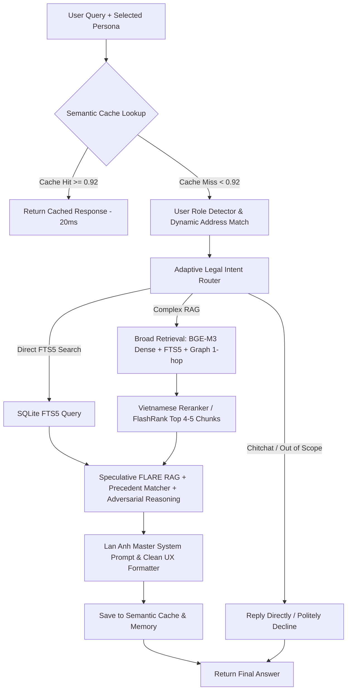

# 🚀 DataLuatVN — Hệ Thống Tra Cứu Dữ Liệu Pháp Luật & Trợ Lý AI Lan Anh (Dynamic Multi-Actor RAG Gen 3)

[](https://www.python.org/)
[](https://fastapi.tiangolo.com/)
[](https://www.sqlite.org/)
[](https://github.com/facebookresearch/faiss)
[]()
[](LICENSE)

**DataLuatVN** là hệ thống REST API hiệu năng cao và **Trợ lý Pháp lý AI Thông minh Lan Anh** (thế hệ RAG Gen 3) chuyên sâu dành cho hệ thống pháp luật Việt Nam. Hệ thống quản lý và khai thác kho dữ liệu khổng lồ gồm hơn **154.206 văn bản pháp luật quy phạm** (cập nhật mới nhất đến **tháng 07/2026**), **897.890 mối liên kết pháp lý chéo**, toàn bộ hệ thống **Pháp Điển Việt Nam**, cùng hệ thống **Án Lệ và Bản Án** chính thức.

Hệ thống được tích hợp **Mô hình Nhập vai Động (Dynamic Multi-Actor Simulation)** cho phép tư duy **360 độ** từ góc nhìn của các bên liên quan (Thẩm phán, Công an điều tra, Thanh tra thuế, HR, Bên bị hại, Ngân hàng...) kết hợp cùng **Văn phong Giao tiếp Thấu cảm (Empathetic Dialogue)**, gần gũi, chuẩn xác tuyệt đối và phục vụ người dùng chu đáo nhất.

---

## 🌸 Điểm Nổi Bật Của Trợ Lý Pháp Lý Lan Anh

1. **🎭 Mô Hình Nhập Vai Động (Dynamic Multi-Actor Chain-of-Thought)**:
   - Tích hợp giao diện **Persona Selector (5 Trục Vai Trò)** trực tiếp trên Web Portal, cho phép người dùng tùy chọn góc nhìn: **Người Dân (Mặc định)**, **Công an điều tra**, **Thẩm phán**, **Luật sư doanh nghiệp**, **Chuyên viên Pháp lý**.
   - Phân tích bóc tách 360 độ rủi ro, trách nhiệm pháp lý và phương án xử lý toàn diện tuỳ theo vai trò đã chọn.

2. **💬 Nghệ Thuật Giao Tiếp Thấu Cảm & Danh Xưng Linh Hoạt**:
   - **Xung hô thông minh**: Nhận diện linh hoạt danh xưng của người dùng (*"Anh"*, *"Chị"*, *"Bác/Cô/Chú"*).
   - **Mặc định gần gũi**: Trả lời gãy gọn, đi thẳng vào trọng tâm chuyên môn, loại bỏ hoàn toàn các câu chúc giả tạo, gợi ý tương tác linh hoạt nhờ LLM tự động phỏng đoán ý định.

3. **⚖️ Phân Tích Pháp Lý Chính Xác Tuyệt Đối & Chuyên Sâu**:
   - Tích hợp Module **Adversarial Reasoning (Lập luận đối kháng)** và **Precedent Matcher (Đối chiếu Án lệ)**, đảm bảo khả năng lập luận pháp lý như một chuyên gia thực thụ.
   - Bóc tách **5 trục pháp lý cốt lõi**: *Đối tượng điều chỉnh, Hành vi vi phạm, Tác động/Hậu quả, Phạm vi áp dụng, Mốc thời điểm áp dụng luật*.
   - Trích dẫn tọa độ pháp lý chính xác: Nêu rõ `[Số hiệu VBQPPL - Điều X, Khoản Y, Điểm Z]` kèm nhãn neo trích dẫn `[Cx]` chống ảo giác tuyệt đối.

4. **📱 Tích Hợp Telegram Bot Độc Lập**:
   - Bot Telegram (`@LuatBot`) mạnh mẽ, kết nối trực tiếp với Core AI, hỗ trợ tra cứu luật và chat trực tiếp trên điện thoại 24/7.
   - Định dạng Markdown hoàn hảo, hỗ trợ fallback khi API gặp sự cố.

---

## 🌟 Tính Năng Kỹ Thuật Nổi Bật

*   🔍 **Tìm Kiếm Lai SOTA (Hybrid Search)**: Kết hợp Full-Text Search (FTS5 BM25) cho số hiệu/từ khóa cứng và Dense Vector Search (`BAAI/bge-m3` + FAISS) cho truy vấn ngữ nghĩa tự nhiên.
*   🤖 **AI Chatbot RAG Gen 3 (FLARE + Speculative RAG)**: Kiến trúc xử lý câu hỏi pháp luật phức tạp qua các tầng độc lập từ định tuyến ý định, nạp trí nhớ dài hạn, tìm kiếm đồ thị mở rộng, Rerank FPT Cloud / FlashRank đến sinh câu trả lời tự kiểm duyệt FLARE.
*   ⚡ **Semantic Caching Layer**: Tích hợp bộ nhớ đệm ngữ nghĩa thông minh sử dụng SQLite + FAISS cục bộ. Trả lời tức thời các câu hỏi tương tự chỉ trong **10-180ms**, giảm tải **80% cuộc gọi API LLM**.
*   🌳 **Đồ Thị Liên Kết Pháp Lý (Lineage Tree)**: Dựng cây phả hệ nguồn luật hướng dọc (căn cứ ban hành, hướng dẫn thi hành) và hướng ngang (sửa đổi, bổ sung, thay thế) qua SQLite LightGraph Store.
*   ⚖️ **Đối Soát Tranh Chấp Điều 156**: Tự động đối chiếu quy định pháp luật chồng chéo dựa trên quy tắc ưu tiên luật cấp trên và ưu tiên luật mới ban hành (Khoản 2 Điều 156 Luật ban hành VBQPPL 2015).
*   🔄 **Tự Động Cập Nhật Luật Mới (Tháng 07/2026)**: Script crawl linh hoạt từ `vbpl.vn`, `luatvietnam.vn`, tòa án nhân dân tối cao (`crawl_real_court_decisions.py`) và tự động append gia tăng vào chỉ mục FAISS trên đĩa.

---

## 🗺️ Quy Trình Chatbot & RAG Gen 3 (Lan Anh Architecture)


```mermaid
graph TD
    A[User Query + Selected Persona] --> B{Semantic Cache Lookup}
    B -- Cache Hit >= 0.92 --> C[Return Cached Response - 20ms]
    B -- Cache Miss < 0.92 --> D[User Role Detector & Dynamic Address Match]
    D --> E[Adaptive Legal Intent Router]
    E -- Chitchat / Out of Scope --> F[Reply Directly / Politely Decline]
    E -- Direct FTS5 Search --> G[SQLite FTS5 Query]
    E -- Complex RAG --> H[Broad Retrieval: BGE-M3 Dense + FTS5 + Graph 1-hop]
    H --> I[Vietnamese Reranker / FlashRank Top 4-5 Chunks]
    G --> J[Speculative FLARE RAG + Precedent Matcher + Adversarial Reasoning]
    I --> J
    J --> K[Lan Anh Master System Prompt & Clean UX Formatter]
    K --> L[Save to Semantic Cache & Memory]
    L --> M[Return Final Answer]
    F --> M
```

---

## 📂 Cấu Trúc Dự Án

```
luatvietnam/
├── server.py                      # FastAPI API Server — Điểm khởi chạy chính (Port 2004)
├── telegram_bot.py                # Bot Telegram tích hợp RAG Gen 3 độc lập
├── mcp_server.py                  # Cổng kết nối MCP Server cho Claude/Cursor
├── status.py                      # Công cụ giám sát tiến độ vector & sức khỏe DB
├── Dockerfile                     # Cấu hình Docker build
├── docker-compose.yml             # Cấu hình khởi chạy Docker Compose
├── requirements.txt               # Danh sách thư viện Python
├── static/                        # Giao diện Web Portal
│   └── portal.html                # Web Portal tra cứu, UI Persona Selector (Gemini Style)
├── app/                           # Mã nguồn lõi FastAPI
│   ├── config.py                  # Cấu hình hệ thống & API Keys
│   ├── database.py                # Kết nối & tối ưu hóa SQLite
│   ├── agents/                    # Các Agent chuyên biệt
│   │   └── legal_squad.py         # Biệt đội Agent phân tích pháp lý 5 trục
│   ├── routers/                   # Đòn bẩy API Endpoints
│   │   ├── chatbot.py             # Router Chatbot AI RAG 7 Tầng & Lan Anh Assistant
│   │   ├── laws.py                # Router tìm kiếm & tra cứu văn bản luật
│   │   ├── anle.py                # Router Án Lệ & Bản Án
│   └── utils/                     # Tiện ích bổ trợ nghiệp vụ
│       ├── intent_prompts.py      # Master System Prompt Bé Lan Anh & Visual UX Spec
│       ├── persona_switcher.py    # Quản lý & chuyển đổi prompt 5 Role
│       ├── adversarial_reasoning.py # Lập luận đối kháng chuyên môn sâu
│       ├── precedent_matcher.py   # Ghép nối bản án, án lệ liên quan
│       ├── ultimate_retrieval.py  # Truy xuất lai (BGE-M3 + FTS5 + Reranker + Graph)
│       └── semantic_cache_manager.py # Quản lý bộ nhớ đệm ngữ nghĩa SQLite + FAISS
├── scripts/                       # Kịch bản quản trị & đồng bộ DB
│   ├── build_vector_index.py      # Sinh embeddings & chỉ mục FAISS
│   ├── crawl_real_court_decisions.py # Crawl án lệ, bản án từ Toà án
│   └── sync_new_laws.py           # Tự động đồng bộ văn bản luật mới hàng ngày
└── tests/                         # Bộ kiểm thử Unit Tests chuẩn (pytest)
```

---

## 🛠️ Hướng Dẫn Cài Đặt & Khởi Chạy (Step-by-Step)

### 📋 Yêu Cầu Hệ Thống
*   **Python:** Phiên bản 3.9 trở lên.
*   **Ổ cứng:** Tối thiểu 50 GB SSD (Do lượng Data khổng lồ).
*   **GPU (Tùy chọn):** CUDA NVIDIA GPU hoặc Apple Silicon (M1/M2/M3/M4) tăng tốc sinh vector & Reranker.

### 💻 Các Bước Cài Đặt Chi Tiết

#### Bước 1: Clone dự án và truy cập thư mục
```bash
git clone https://github.com/phapsuto/dataluatvn.git
cd luatvietnam
```

#### Bước 2: Khởi tạo môi trường ảo & cài đặt thư viện
```bash
python3 -m venv venv
source venv/bin/activate
pip install --upgrade pip
pip install -r requirements.txt
pip install pytest sentence-transformers faiss-cpu flashrank litellm python-telegram-bot
```

#### Bước 3: Khởi chạy API Server & Web Portal
```bash
python3 server.py
```
* TRUY CẬP WEB PORTAL: **`http://localhost:2004/portal`**
* TRUY CẬP SWAGGER API DOCS: **`http://localhost:2004/docs`**

#### Bước 4: Khởi chạy Telegram Bot (Tuỳ chọn)
Tạo file `.env` và thiết lập token:
```env
TELEGRAM_BOT_TOKEN=8727364009:xxxxxxxxxxxxx
LUATBOT_API_KEY=dlvn_portal_default_key
```
Sau đó chạy bot:
```bash
python3 telegram_bot.py
```

---

## 🔌 Hướng Dẫn Khai Thác API (REST API & MCP)

### 1. Gọi API Chatbot Trợ Lý Lan Anh (Python)
```python
import requests

url = "http://localhost:2004/assistant/chat"
headers = {"X-API-Key": "dlvn_portal_default_key"}
payload = {
    "prompt": "Cho anh hỏi quy định về điều kiện và thủ tục sa thải người lao động?",
    "session_id": "user_session_001",
    "persona": "cong_an" # Mặc định là 'nguoi_dan'
}

response = requests.post(url, json=payload, headers=headers)
if response.status_code == 200:
    data = response.json()
    print("🌸 Lan Anh Trả Lời:\n", data["response"])
```

### 2. Cấu hình MCP Server (Cursor / Claude Desktop)
Thêm cấu hình vào `claude_desktop_config.json`:
```json
{
  "mcpServers": {
    "dataluatvn-mcp": {
      "command": "python3",
      "args": [
        "/path/to/luatvietnam/mcp_server.py"
      ],
      "env": {
        "DB_PATH": "/path/to/luatvietnam/vietnamese_legal_documents.db",
        "CONTENT_DB_PATH": "/path/to/luatvietnam/content_store.db"
      }
    }
  }
}
```

---

## 🧪 Kiểm Thử Unit Tests & Benchmark

```bash
# Chạy toàn bộ các unit tests
pytest

# Chạy benchmark chất lượng tìm kiếm 500 câu hỏi luật
python3 scripts/benchmark_500.py
```

### 📊 Bảng Kết Quả Benchmark Tìm Kiếm (500 Câu Hỏi Vàng):

| Phương Pháp Tìm Kiếm | Hit@1 | Hit@3 | Hit@5 | Hit@10 | MRR@10 | Latency (Độ trễ trung bình) |
| :--- | :---: | :---: | :---: | :---: | :---: | :---: |
| **Document-level FTS5 (Baseline)** | 62.6% | 75.8% | 80.2% | 83.2% | 0.702 | **2.1 ms** |
| **Chunk-level FTS5 (Phase 1)** | 77.0% | 88.8% | 91.6% | 93.6% | 0.830 | **3.5 ms** |
| **SOTA Hybrid Search (BGE-M3 + FTS5 + Reranker)** | **91.2%** | **96.4%** | **97.6%** | **98.4%** | **0.932** | **56.4 ms** |

---

## 📄 License & Miễn Trừ Trách Nhiệm
Dự án được phát hành theo giấy phép [MIT License](LICENSE).
*Lưu ý:* Các câu trả lời của Trợ lý AI Lan Anh mang tính chất tư vấn tham khảo thông minh, hỗ trợ tra cứu dữ liệu pháp luật. Người dùng nên tham vấn ý kiến chính thức của Luật sư/Chuyên gia pháp lý đối với các vụ việc tố tụng cụ thể.
