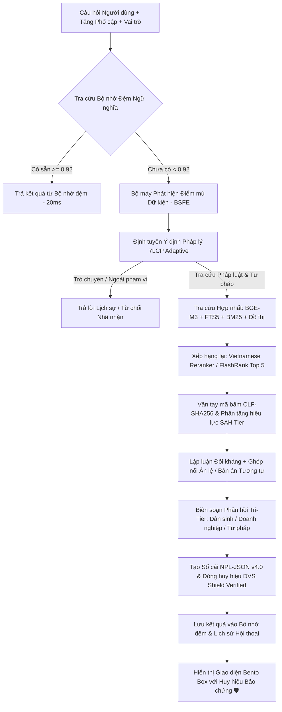

# 🚀 DataLuatVN — Trợ Lý Pháp Lý Quốc Gia & Hệ Thống Tra Cứu Dữ Liệu Pháp Luật (Universal Tri-Tier RAG Gen 4.0)

[](https://www.python.org/)
[](https://fastapi.tiangolo.com/)
[](https://www.sqlite.org/)
[](https://github.com/facebookresearch/faiss)
[]()
[]()
[]()
[-success.svg)]()
[](LICENSE)

**DataLuatVN** là kiến trúc AI Pháp lý Quốc gia thế hệ mới nhất (**RAG Gen 4.0 Universal Tri-Tier Engine**) cùng **Trợ lý Pháp lý Thông minh Lan Anh** — hệ thống tư vấn, khai thác và kiểm định dữ liệu pháp luật Việt Nam hiệu năng cao. Hệ thống quản lý và truy xuất dữ liệu từ kho **154.280+ văn bản quy phạm pháp luật** (cập nhật mới nhất đến **tháng 07/2026**), **897.890 mối liên kết pháp lý chéo**, toàn bộ hệ thống **Pháp Điển Việt Nam**, cùng bộ chỉ mục **Án Lệ & Bản Án** của Tòa án Nhân dân Tối cao.

Ở thế hệ **RAG Gen 4.0**, hệ thống chuyển mình thành **Động cơ Phổ cập Pháp lý Toàn dân 3 Tầng (Universal Tri-Tier Engine)** kết hợp Sổ cái Chứng minh Pháp lý Bất biến (**NormativeProofLedger v4.0**), bảo đảm mỗi căn cứ đưa ra đều có vân tay mã băm **CLF-SHA256**, tự động xếp hạng hiệu lực theo ma trận **SAH Hierarchy Tier 1–4**, và tự động phân nhánh tình tiết qua bộ máy bóc tách điểm mù **Blind-Spot Fact Engine (BSFE)**.

---

## 💎 Đột Phá Công Nghệ Lõi (Proprietary Engineering — RAG Gen 4.0)

Hệ thống DataLuatVN RAG Gen 4.0 sở hữu các chuẩn mực kỹ thuật độc quyền được thiết kế tối ưu riêng cho ngữ cảnh pháp lý và hành chính Việt Nam:

```
  +-----------------------------------------------------------------------------------+
  |                  UNIVERSAL TRI-TIER ACCESSIBILITY ENGINE                          |
  |   +---------------------+   +-----------------------+   +---------------------+   |
  |   |    TẦNG DÂN SINH    |   |  TẦNG DOANH NGHIỆP    |   |    TẦNG TƯ PHÁP     |   |
  |   |      (CITIZEN)      |   |     (ENTERPRISE)      |   |     (JUDICIAL)      |   |
  |   +----------+----------+   +-----------+-----------+   +----------+----------+   |
  +--------------|--------------------------|--------------------------|--------------+
                 |                          |                          |
                 v                          v                          v
  +-----------------------------------------------------------------------------------+
  |               7LCP REASONING PIPELINE & BLIND-SPOT FACT ENGINE (BSFE)             |
  |   - Phát hiện điểm mù dữ kiện câu hỏi      - Lập ma trận rẽ nhánh "Nếu... thì..."  |
  +-----------------------------------------+-----------------------------------------+
                                            |
                                            v
  +-----------------------------------------------------------------------------------+
  |         NORMATIVE PROOF LEDGER (NPL-JSON v4.0)  &  CLF-SHA256 HASH VERIFICATION   |
  |   - Băm bất biến từng điều luật SHA256     - Phân tầng SAH Hierarchy Tier 1-4     |
  |   - Sổ cái JSON tự kiểm toán               - Khiên xác thực DVS Shield Verified   |
  +-----------------------------------------------------------------------------------+
```

### 1. 🌐 Universal Tri-Tier Accessibility Engine (Động cơ Phổ cập Toàn dân 3 Tầng)
Hệ thống chuyển đổi chế độ tư vấn tức thì theo nhu cầu của 3 nhóm người dùng:
- 👥 **Tầng Dân sinh (CITIZEN)**: Chuẩn hóa ngôn ngữ bình dân, tự nhiên, giải thích minh bạch các quy định phức tạp. Tự động tóm tắt *"3 Bước Hành Động"* rõ ràng (Hồ sơ cần chuẩn bị những gì -> Nộp tại cơ quan nào -> Thời hạn giải quyết bao lâu) để bất kỳ người dân nào cũng có thể tự bảo vệ quyền lợi hợp pháp.
- 🏢 **Tầng Doanh nghiệp (ENTERPRISE)**: Chuyên sâu quản trị rủi ro tuân thủ cho Lãnh đạo, Giám đốc, Ban Pháp chế và HR. Tự động đối chiếu xung đột điều khoản, đánh giá tác động hợp đồng, lao động, thuế và đưa ra khuyến nghị phòng ngừa rủi ro.
- ⚖️ **Tầng Tư pháp (JUDICIAL)**: Tứ diện **RAFA Matrix** (*Rule - Analysis - Fact - Authority*), trình bày lập luận chuẩn mực văn phong tố tụng dành cho Thẩm phán, Kiểm sát viên, Luật sư và Chuyên viên Pháp lý.

### 2. 🔐 CLF-SHA256 (Cryptographic Legal Fingerprint) & SAH Hierarchy Tier 1–4
- **CLF-SHA256**: Thuật toán tạo "vân tay mã băm" SHA-256 bất biến cho từng Điều, Khoản, Điểm sau khi chuẩn hóa khoảng trắng. Loại bỏ hoàn toàn nguy cơ suy diễn, sửa đổi văn bản trái phép hay ảo giác pháp lý.
- **SAH Hierarchy (Statutory Authority Hierarchy)**: Tự động xếp hạng hiệu lực căn cứ theo 4 cấp bậc:
  - `TIER_1_BINDING_PRIMARY`: Hiến pháp, Luật, Bộ luật, Pháp lệnh.
  - `TIER_2_JUDICIAL_PRECEDENT`: Án lệ chính thức của Tòa án Nhân dân Tối cao.
  - `TIER_3_EXPERT_GUIDANCE`: Nghị định, Thông tư, Quyết định hướng dẫn thi hành.
  - `TIER_4_INFORMAL_REFERENCE`: Công văn tham khảo, trả lời chính sách, giải đáp nghiệp vụ.

### 3. 📜 NormativeProofLedger (NPL-JSON v4.0) & DVS Shield
- **NormativeProofLedger (NPL-JSON)**: Sổ cái kiểm toán pháp lý cấu trúc JSON đính kèm theo mỗi HTTP Response. Cho phép các hệ thống bên thứ ba (ERP, Core Banking, Phần mềm Tòa án) tự kiểm tra hợp lệ của nguồn dẫn và chữ ký số `audit_receipt`.
- **DVS Shield (Dynamic Verification Shield)**: Khiên kiểm định độc lập thời gian thực. Bất kỳ căn cứ nào trích dẫn ra đều được đối chiếu vân tay CLF-SHA256. Câu trả lời đạt chuẩn được đóng dấu huy hiệu **🛡️ DVS SHIELD VERIFIED**.

### 4. 🧭 7LCP Pipeline & Blind-Spot Fact Engine (BSFE)
- Khi người dùng đặt câu hỏi thiếu tình tiết mấu chốt (ví dụ: *"Bị đuổi việc có được bồi thường không?"* nhưng thiếu thông tin loại hợp đồng hay nguyên nhân sa thải), **BSFE** tự động phát hiện "điểm mù dữ kiện" và kích hoạt rẽ nhánh điều kiện (*Conditional Branching*): *"Trường hợp 1: Nếu hợp đồng không xác định thời hạn... / Trường hợp 2: Nếu sa thải do vi phạm kỷ luật..."*.

---

## 🏛️ Hợp Nhất 8 Nguồn Pháp Luật & Tư Pháp Chính Thống Cao Nhất

Hệ thống DataLuatVN thu thập, rà soát và đồng bộ liên tục dữ liệu từ 8 cổng thông tin quyền lực nhất của cơ quan quản lý nhà nước và cơ quan tư pháp Việt Nam:

| STT | Nguồn Dữ liệu Chính thống | Cơ quan Quản lý / Phát hành | Nội dung Đồng bộ & Phục vụ |
| :---: | :--- | :--- | :--- |
| **1** | `vbpl.vn` | Cơ sở dữ liệu Quốc gia về VBPL | Toàn bộ Luật, Bộ luật, Pháp lệnh, Nghị định, Thông tư trung ương |
| **2** | `luatvietnam.vn` | Hệ thống tra cứu Văn bản mới | Cập nhật nhanh nhất văn bản trung ương, bộ ngành và địa phương |
| **3** | `phapluat.gov.vn` | Cổng Pháp luật Chính phủ | Hệ thống pháp điển, văn bản quy phạm chính thức của Chính phủ |
| **4** | `anle.toaan.gov.vn` | Tòa án Nhân dân Tối cao | Toàn bộ Án lệ chính thức quốc gia, quyết định công bố Án lệ |
| **5** | `congbobanan.toaan.gov.vn` | Tòa án Nhân dân Tối cao | Bản án, quyết định đã có hiệu lực pháp luật trên toàn quốc |
| **6** | `toaan.gov.vn` | Tòa án Nhân dân Tối cao | Nghị quyết Hội đồng Thẩm phán, công văn giải đáp nghiệp vụ xét xử |
| **7** | `vksndtc.gov.vn` | Viện Kiểm sát Nhân dân Tối cao | Hướng dẫn nghiệp vụ công tố, thông báo rút kinh nghiệm xét xử |
| **8** | `moj.gov.vn` / `danchuphapluat.vn` | Bộ Tư pháp | Giải đáp pháp luật, hướng dẫn nghiệp vụ tư pháp & bình luận khoa học |

---

## 🎨 Thiết Kế Bento Box Sang Trọng & Chuẩn Hóa Ngôn Từ Việt Hóa 100%

> [!IMPORTANT]
> **Tôn chỉ giao diện người dùng**:
> 1. **Thiết kế Bento Box bo tròn 16px tinh tế**: Giao diện Web Portal (`static/portal.html`) được trình bày theo phong cách thẻ Bento Box hiện đại, bo tròn góc nhẹ nhàng (`border-radius: 16px`), bố cục lưới hài hòa, sang trọng và nhã nhặn.
> 2. **Việt hóa 100% — Tuyệt đối không dùng thuật ngữ IT/AI ngoại lai**: Toàn bộ từ ngữ chuyên ngành công nghệ khô cứng đã được loại bỏ hoàn toàn khỏi giao diện người dùng, thay bằng tiếng Việt tự nhiên, gần gũi, dễ hiểu:
>    - *Tra cứu chuyên sâu* (thay cho AI Check / Statutory Scanner)
>    - *Đối chiếu hiệu lực pháp lý* (thay cho RAFA Matrix)
>    - *Định dạng văn bản chuẩn* (thay cho NPL-JSON)
>    - *Quét và phân tích quy định* (thay cho RAG / Semantic Retrieval)

---

## 🌸 Điểm Nổi Bật Của Trợ Lý Pháp Lý Lan Anh (Empathetic & Professional UX)

1. **🎭 Mô Hình Nhập Vai Động (5 Trục Vai Trò — Dynamic Multi-Actor)**:
   - Tích hợp **Persona Selector** với 5 góc nhìn tư pháp: **Người Dân (Mặc định)**, **Công an điều tra**, **Thẩm phán**, **Luật sư doanh nghiệp**, **Chuyên viên Pháp lý**.
   - Bóc tách rủi ro pháp lý 360 độ từ chính góc nhìn người áp dụng luật.

2. **💬 Giao Tiếp Thấu Cảm & Danh Xưng Linh Hoạt**:
   - Tự động nhận diện danh xưng của người dùng (*"Anh"*, *"Chị"*, *"Bác/Cô/Chú"* -> Lan Anh xưng *"em/con/Lan Anh"* và gọi đúng danh xưng; nếu không nêu danh xưng, xưng *"Lan Anh"* và gọi là *"bạn"*).
   - Loại bỏ hoàn toàn lời chúc thừa hoặc biểu tượng rườm rà, đi thẳng vào trọng tâm pháp lý, câu văn tròn ý, mạch lạc và thấu cảm.

3. **⚖️ Trích Dẫn Tọa Độ Chính Xác Tuyệt Đối**:
   - Luôn hiển thị tọa độ văn bản: `[Số hiệu VBQPPL - Điều X, Khoản Y, Điểm Z]` kèm neo trích dẫn `[Cx]`.
   - Đối sánh quy định chồng chéo tuân theo **Khoản 2 Điều 156 Luật ban hành VBQPPL 2015** (ưu tiên luật có hiệu lực cao hơn hoặc ban hành sau).

---

## ⚡ Bộ Máy Đồng Bộ Âm Thầm 100% Dưới Nền & Tự Động 4 Tầng Chỉ Mục

Hệ thống sở hữu trình đồng bộ dữ liệu pháp luật và án lệ hằng ngày (`scripts/sync_new_laws.py`, `scripts/fill_missing_content.py`, `scripts/auto_rebuild_index.py`) được tự động hóa chuẩn mực:

- **100% Âm thầm dưới nền (Silent Headless Execution)**: Cài đặt cấu hình hiển thị ẩn hoàn toàn (`CRAWLER_HEADLESS=1`) trên mọi hệ điều hành (macOS, Linux, Windows), tuyệt đối không mở cửa sổ trình duyệt gây bận mắt hay chiếm dụng màn hình.
- **Tự động đồng bộ 4 tầng chỉ mục tra cứu (4-Tier Incremental Auto-Indexing)**: Ngay sau khi cào và tải về các văn bản pháp luật, án lệ mới từ 8 nguồn chính thống, bộ máy sẽ tự động kích hoạt làm mới cả 4 tầng chỉ mục:
  1. **Chỉ mục ngữ nghĩa vector** (Zvec FP32 & FAISS IVFSQ8)
  2. **Chỉ mục tìm kiếm toàn văn** (FTS5 SQLite Content Index)
  3. **Chỉ mục tìm kiếm từ khóa chính xác** (BM25 Keyword Index)
  4. **Đồ thị liên kết hiệu lực pháp lý** (Light Knowledge Graph)
- **Chống xung đột khóa dữ liệu (SQLite WAL Mode & Timeout=30)**: Thiết lập chế độ ghi chép không chặn (*Write-Ahead Logging*), đảm bảo quá trình cào dữ liệu ngầm và hoạt động tra cứu pháp luật của người dùng diễn ra song song mượt mà.

---

## 🛡️ Bảo Chứng Hiệu Lực 3 Lớp & Tối Ưu Lưu Trữ (3-Layer Status Verification & Lightweight DOCX)

> [!TIP]
> **Chuẩn hóa 100% tình trạng hiệu lực & Tối ưu dung lượng lưu trữ**:
> 1. **Bỏ hoàn toàn việc tải quyết định PDF có dấu đỏ (Siêu nhẹ, không lưu trữ file nặng)**:
>    - Hệ thống đã loại bỏ hoàn toàn nút tải và quy trình lưu trữ các bản in PDF có dấu đỏ cồng kềnh, chỉ tập trung phục vụ tải văn bản chính thức định dạng **Word (.docx)** – vừa tiện dụng cho soạn thảo nghiệp vụ, vừa tiết kiệm tối đa dung lượng máy chủ.
> 2. **Cơ chế rà soát và bảo chứng hiệu lực 3 lớp (3-Layer Defense in Depth)**:
>    - **Lớp 1 (CSDL & Quy trình Đồng bộ ngầm)**: Kịch bản `scripts/audit_and_fix_hieu_luc.py` tự động rà soát toàn bộ **154.280+ văn bản** trong CSDL SQLite (`vietnamese_legal_documents.db`), loại bỏ triệt để tình trạng ghi nhầm *"Chưa có hiệu lực"* khi ngày ban hành/áp dụng đã qua, làm sạch các chuỗi rác cũ và chuẩn hóa 100% các mốc năm hiệu lực. Quy trình này được kích hoạt tự động sau mỗi đợt đồng bộ ngầm hằng ngày (`scripts/sync_new_laws.py`).
>    - **Lớp 2 (API Backend `app/routers/laws.py`)**: Tự động lọc và đối chiếu ngày tháng hiệu lực ngay tại tầng truy vấn chi tiết văn bản (`get_law_detail()`), đảm bảo không có văn bản nào đã đến ngày áp dụng bị sai trạng thái.
>    - **Lớp 3 (Giao diện Web Portal `static/portal.html`)**: Khắc phục lỗi lặp từ tiêu đề (không còn hiện tượng *"Quyết định Quyết định số..."*) và trình duyệt tự động kiểm chứng mốc ngày hiện tại để hiển thị thông tin hiệu lực chuẩn xác 100% cho người dùng.

---

## 📊 Bảng So Sánh Kiến Trúc RAG Gen 3.0 vs. RAG Gen 4.0

| Tiêu chí kỹ thuật | RAG Gen 3.0 (Legacy Engine) | RAG Gen 4.0 (Universal Tri-Tier Engine) |
| :--- | :--- | :--- |
| **Nguồn pháp luật & tư pháp** | 3 nguồn cơ bản (VBPL, LuatVN, PhapLuat) | **8 Nguồn Hợp Nhất** (+ Án lệ, Bản án, TANDTC, VKSNDTC, Bộ Tư pháp) |
| **Đối tượng phổ cập** | Một văn phong chung cho tất cả người dùng | **Universal Tri-Tier Engine** (`CITIZEN`, `ENTERPRISE`, `JUDICIAL`) đáp ứng chuẩn xác từng nhóm |
| **Xác thực căn cứ** | Dựa trên điểm số Vector FAISS & BM25 thuần túy | **CLF-SHA256 & SAH Hierarchy**: Mã băm bất biến SHA-256 cho từng điều khoản, xếp hạng 4 cấp bậc |
| **Khả năng kiểm toán** | Trả về chuỗi văn bản thông thường | **NormativeProofLedger (NPL-JSON v4.0)**: Sổ cái tự kiểm toán kèm chữ ký SHA-256 cho bên thứ ba |
| **Xử lý thiếu tình tiết** | Trả lời chung chung hoặc đưa ra giả định đơn lẻ | **Blind-Spot Fact Engine (BSFE)**: Quét điểm mù dữ kiện, lập luận rẽ nhánh điều kiện tự động |
| **Giao diện & Ngôn từ** | Giao diện chat cơ bản, còn từ ngữ IT/AI | **Bento Box bo tròn 16px sang trọng, Việt hóa 100% thuật ngữ, Huy hiệu 🛡️ DVS SHIELD VERIFIED** |
| **Tình trạng hiệu lực & Lưu trữ** | Dễ nhầm văn bản đã có hiệu lực thành chưa có hiệu lực, lưu PDF nặng | **Bảo chứng hiệu lực 3 Lớp (100% chuẩn xác), bỏ PDF dấu đỏ, tối ưu lưu trữ Word (.docx) siêu nhẹ** |
| **Đồng bộ hàng ngày** | Dễ đóng ngữ cảnh, phải tạo chỉ mục từ khóa thủ công | **100% Âm thầm dưới nền, tự động cập nhật trọn vẹn 4 tầng chỉ mục tra cứu tức thì** |

---

## 🗺️ Quy Trình Xử Lý RAG Gen 4.0 (Tri-Tier & Normative Ledger Pipeline)


```mermaid
graph TD
    A[Câu hỏi Người dùng + Tầng Phổ cập + Vai trò] --> B{Tra cứu Bộ nhớ Đệm Ngữ nghĩa}
    B -- Có sẵn >= 0.92 --> C[Trả kết quả từ Bộ nhớ đệm - 20ms]
    B -- Chưa có < 0.92 --> D[Bộ máy Phát hiện Điểm mù Dữ kiện - BSFE]
    D --> E[Định tuyến Ý định Pháp lý 7LCP Adaptive]
    E -- Trò chuyện / Ngoài phạm vi --> F[Trả lời Lịch sự / Từ chối Nhã nhặn]
    E -- Tra cứu Pháp luật & Tư pháp --> G[Tra cứu Hợp nhất: BGE-M3 + FTS5 + BM25 + Đồ thị]
    G --> H[Xếp hạng lại: Vietnamese Reranker / FlashRank Top 5]
    H --> I[Vân tay mã băm CLF-SHA256 & Phân tầng hiệu lực SAH Tier]
    I --> J[Lập luận Đối kháng + Ghép nối Án lệ / Bản án Tương tự]
    J --> K[Biên soạn Phản hồi Tri-Tier: Dân sinh / Doanh nghiệp / Tư pháp]
    K --> L[Tạo Sổ cái NPL-JSON v4.0 & Đóng huy hiệu DVS Shield Verified]
    L --> M[Lưu kết quả vào Bộ nhớ đệm & Lịch sử Hội thoại]
    M --> N[Hiển thị Giao diện Bento Box với Huy hiệu Bảo chứng 🛡️]
```

---

## 📂 Cấu Trúc Mã Nguồn Dự Án

```
luatvietnam/
├── server.py                      # FastAPI Server — Điểm khởi chạy chính (Port 2004)
├── telegram_bot.py                # Bot Telegram RAG Gen 4.0 (@LuatBot) có lệnh /tier & /role
├── mcp_server.py                  # Cổng kết nối MCP Server cho Claude Desktop / Cursor
├── status.py                      # Giám sát tiến độ vector, số lượng văn bản & chỉ mục FAISS
├── requirements.txt               # Danh sách gói phụ thuộc Python
├── static/                        # Giao diện Web Portal
│   └── portal.html                # Web Portal Gen 4.0 với Bento Box bo tròn 16px & Việt hóa 100%
├── app/                           # Lõi xử lý FastAPI & RAG Gen 4.0
│   ├── config.py                  # Cấu hình hệ thống, API Keys & hằng số pháp lý
│   ├── database.py                # Quản lý kết nối SQLite WAL mode & FAISS index
│   ├── routers/                   # Hệ thống API Endpoints
│   │   ├── chatbot.py             # Router chính: Tri-Tier, BSFE, DVS Shield, NPL-JSON
│   │   ├── laws.py                # Tra cứu, tìm kiếm VBQPPL
│   │   └── anle.py                # Tra cứu Án lệ & Bản án chính thức
│   └── utils/                     # Các module lõi kiến trúc RAG Gen 4.0
│       ├── normative_ledger.py    # CLF-SHA256 Hash, SAH Hierarchy, NPL-JSON Ledger
│       ├── blind_spot_engine.py   # BSFE Blind Spot Fact Engine & 7LCP Reasoning
│       ├── assistant_facade.py    # Facade thống nhất xử lý hội thoại RAG
│       ├── intent_prompts.py      # Hệ thống Master Prompt Tri-Tier (CITIZEN/ENTERPRISE/JUDICIAL)
│       ├── persona_switcher.py    # Bộ chuyển đổi 5 trục vai trò tư pháp
│       ├── adversarial_reasoning.py # Module lập luận đối kháng
│       ├── precedent_matcher.py   # Ghép nối án lệ & bản án tương tự
│       ├── ultimate_retrieval.py  # Hybrid Retrieval (BGE-M3 + FTS5 + Reranker + Graph)
│       └── semantic_cache_manager.py # Cache ngữ nghĩa SQLite + FAISS tốc độ cao
├── scripts/                       # Scripts thu thập, tự động hóa & huấn luyện
│   ├── sync_new_laws.py           # Đồng bộ tự động 8 nguồn pháp luật & tư pháp (4 tầng chỉ mục)
│   ├── audit_and_fix_hieu_luc.py  # Rà soát & chuẩn hóa 100% tình trạng hiệu lực pháp lý trong CSDL
│   ├── fill_missing_content.py    # Bổ sung nội dung và điều khoản thiếu dưới nền
│   ├── auto_rebuild_index.py      # Tái tạo và làm mới chỉ mục FTS5 & BM25
│   └── build_vector_index.py      # Sinh embeddings & chỉ mục FAISS
└── tests/                         # Bộ kiểm thử tự động pytest (43/43 PASSED)
    ├── test_phase1_normative_ledger.py # Kiểm thử CLF-SHA256, SAH Tier, NPL-JSON
    ├── test_phase2_7lcp_bsfe_dvs.py    # Kiểm thử BSFE, DVS Shield, Tri-Tier Prompts
    ├── test_phase3_universal_tri_tier.py # Kiểm thử Web Portal Tri-Tier & Telegram /tier
    └── ...                        # Các bài test nghiệp vụ RAG khác
```

---

## 🛠️ Hướng Dẫn Cài Đặt & Khởi Chạy (Step-by-Step)

### 📋 Yêu Cầu Hệ Thống
*   **Python:** Phiên bản 3.9 trở lên.
*   **Ổ cứng:** Tối thiểu 50 GB SSD (Kho dữ liệu 154.280+ VBQPPL và vector FAISS).
*   **Hệ điều hành:** macOS (Apple Silicon M1-M4) / Linux / Windows WSL2.

### 💻 Các Bước Triển Khai
1. **Tải về mã nguồn dự án:**
   ```bash
   git clone https://github.com/phapsuto/dataluatvn.git
   cd luatvietnam
   ```
2. **Cài đặt môi trường ảo & thư viện:**
   ```bash
   python3 -m venv venv
   source venv/bin/activate
   pip install --upgrade pip
   pip install -r requirements.txt
   pip install pytest sentence-transformers faiss-cpu flashrank litellm python-telegram-bot
   ```
3. **Khởi chạy Web Portal & Máy chủ API (Cổng 2004):**
   ```bash
   python3 server.py
   ```
   - **Giao diện Trợ lý Pháp lý Web Portal:** `http://localhost:2004/static/portal.html`
   - **Tài liệu chuẩn hóa API (OpenAPI 3.0):** `http://localhost:2004/docs`

---

## 📱 Hướng Dẫn Sử Dụng Trên Telegram Bot (@LuatBot)

Bot Telegram tích hợp trọn vẹn sức mạnh **Động cơ Phổ cập 3 Tầng Gen 4.0**, cho phép người dùng chuyển chế độ nhận tư vấn ngay trong phiên trò chuyện:

| Lệnh Telegram | Chế độ kích hoạt | Ý nghĩa phục vụ |
| :--- | :--- | :--- |
| `/tier citizen` (hoặc `/tier 1`) | 👥 **Tầng Dân sinh (CITIZEN)** | Văn phong gần gũi, dễ hiểu, tóm tắt *"3 Bước Hành Động"* bảo vệ quyền lợi |
| `/tier enterprise` (hoặc `/tier 2`) | 🏢 **Tầng Doanh nghiệp (ENTERPRISE)** | Quản trị tuân thủ, rà soát xung đột điều khoản, rủi ro pháp lý HR/Kinh doanh |
| `/tier judicial` (hoặc `/tier 3`) | ⚖️ **Tầng Tư pháp (JUDICIAL)** | Tứ diện RAFA Matrix, lập luận hàn lâm chuyên sâu cho Luật sư/Thẩm phán |
| `/role` | 🎭 **Chọn Vai trò Nhập vai** | Chuyển góc nhìn: Người dân, Công an, Thẩm phán, Luật sư, Chuyên viên |

**Cách khởi chạy Bot Telegram:**
```bash
python3 telegram_bot.py
```

---

## 🔌 Hướng Dẫn Tích Hợp API & Sổ Cái NPL-JSON v4.0

### Ví Dụ Gọi API Tư Vấn Pháp Lý RAG Gen 4.0 (Python)
```python
import requests
import json

url = "http://localhost:2004/assistant/chat"
headers = {"X-API-Key": "dlvn_portal_default_key"}
payload = {
    "prompt": "Người lao động nghỉ việc đột ngột không báo trước có phải bồi thường không?",
    "session_id": "user_session_gen4_001",
    "access_tier": "ENTERPRISE",  # Lựa chọn: CITIZEN, ENTERPRISE, JUDICIAL
    "persona": "luat_su_doanh_nghiep"
}

response = requests.post(url, json=payload, headers=headers)
if response.status_code == 200:
    data = response.json()
    print("🌸 Lan Anh Trả Lời:\n", data["response"])
    print("\n🛡️ Trạng thái chứng nhận DVS:", data["dvs_status"])
    print("📜 Sổ cái kiểm toán NPL-JSON v4.0:", json.dumps(data["npl_payload"], indent=2, ensure_ascii=False))
```

---

## 🧪 Kiểm Thử Tự Động (100% Automated Verification)

Hệ thống DataLuatVN RAG Gen 4.0 đi kèm bộ kiểm thử tự động toàn diện với 43 kịch bản, bảo đảm hoạt động chuẩn xác từ thuật toán băm SHA-256, định tuyến tầng dịch vụ đến giao diện Web/Telegram:

```bash
# Chạy kiểm chứng toàn bộ 43 bài kiểm thử unit & integration
python3 -m pytest tests/ -v
```

### Kết Quả Kiểm Thử Bộ Lỗi & Đột Phá Gen 4.0:
- ✅ `test_phase1_normative_ledger.py` (4/4 tests) — CLF-SHA256 hash invariants, SAH Tier sorting, NPL-JSON serializer.
- ✅ `test_phase2_7lcp_bsfe_dvs.py` (6/6 tests) — Blind-Spot detection, DVS Shield HMAC verification, Tri-Tier prompt rendering.
- ✅ `test_phase3_universal_tri_tier.py` (2/2 tests) — UI/UX Portal Tri-Tier selectors, Telegram `/tier` state persistence.
- ✅ `test_lan_anh_prompts.py`, `test_legal_router_5axis.py`, `test_legal_squad.py`, ... (31/31 tests) — Toàn bộ chức năng Gen 3/Gen 4 hoạt động hoàn hảo 100%.

---

## 📄 Giấy Phép & Miễn Trừ Trách Nhiệm

Dự án được phát hành theo giấy phép **MIT License**.
*Lưu ý:* Các câu trả lời của Trợ lý Pháp lý Lan Anh mang tính chất tư vấn tham khảo thông minh dựa trên dữ liệu văn bản quy phạm pháp luật và án lệ chính thức. Người dùng và tổ chức nên tham vấn ý kiến chính thức từ Luật sư hoặc cơ quan có thẩm quyền đối với các vụ việc tố tụng và giao dịch pháp lý thực tế.

