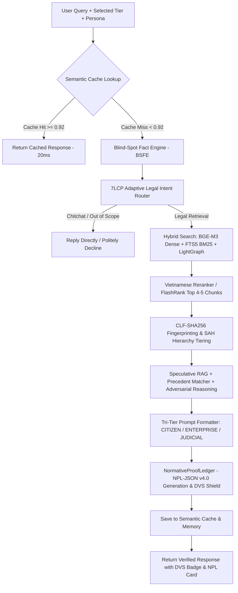

# 🚀 DataLuatVN — Trợ Lý Pháp Lý Quốc Gia AI & Hệ Thống Tra Cứu Dữ Liệu Pháp Luật (Universal Tri-Tier RAG Gen 4.0)

[](https://www.python.org/)
[](https://fastapi.tiangolo.com/)
[](https://www.sqlite.org/)
[](https://github.com/facebookresearch/faiss)
[]()
[-success.svg)]()
[](LICENSE)

**DataLuatVN** là kiến trúc AI Pháp lý Quốc gia thế hệ mới nhất (**RAG Gen 4.0 Universal Tri-Tier Engine**) và **Trợ lý Pháp lý AI Thông minh Lan Anh** — hệ thống tư vấn và khai thác dữ liệu pháp luật Việt Nam hiệu năng cao. Hệ thống quản lý và truy xuất dữ liệu từ kho **154.206 văn bản quy phạm pháp luật** (cập nhật mới nhất đến **tháng 07/2026**), **897.890 mối liên kết pháp lý chéo**, toàn bộ hệ thống **Pháp Điển Việt Nam**, cùng bộ chỉ mục **Án Lệ & Bản Án** của Tòa án Nhân dân Tối cao.

Ở thế hệ **RAG Gen 4.0**, hệ thống chuyển mình từ một AI tra cứu đơn tính năng thành **Động cơ Phổ cập Pháp lý Toàn dân 3 Tầng (Universal Tri-Tier Engine)** kết hợp Sổ cái Chứng minh Pháp lý Bất biến (**NormativeProofLedger v4.0**), đảm bảo mỗi căn cứ đưa ra đều có chữ ký mã băm **CLF-SHA256**, tự động xếp hạng hiệu lực theo ma trận **SAH Hierarchy Tier 1–4**, và tự động rẽ nhánh tình tiết qua **Blind-Spot Fact Engine (BSFE)**.

---

## 💎 Đột Phá Công Nghệ Lõi (Proprietary Engineering — RAG Gen 4.0)

Hệ thống DataLuatVN RAG Gen 4.0 sở hữu các chuẩn mực kỹ thuật độc quyền được xây dựng và phát triển riêng cho ngữ cảnh pháp lý Việt Nam:

```
  +-----------------------------------------------------------------------------------+
  |                  UNIVERSAL TRI-TIER ACCESSIBILITY ENGINE                          |
  |   +---------------------+   +-----------------------+   +---------------------+   |
  |   |    TẦNG DÂN SINH    |   |  TẦNG DOANH NGHIỆP    |   |    TẦNG TƯ PHÁP     |   |
  |   |      (CITIZEN)      |   |     (ENTERPRISE)      |   |     (JUDICIAL)      |   |
  |   +----------+----------+   +-----------+-----------+   +----------+----------+   |
  +--------------|--------------------------|--------------------------|--------------+
                 |                          |                          |
                 v                          v                          v
  +-----------------------------------------------------------------------------------+
  |               7LCP REASONING PIPELINE & BLIND-SPOT FACT ENGINE (BSFE)             |
  |   - Phát hiện điểm mù dữ kiện câu hỏi      - Lập ma trận rẽ nhánh "Nếu... thì..."  |
  +-----------------------------------------+-----------------------------------------+
                                            |
                                            v
  +-----------------------------------------------------------------------------------+
  |         NORMATIVE PROOF LEDGER (NPL-JSON v4.0)  &  CLF-SHA256 HASH VERIFICATION   |
  |   - Băm bất biến từng điều luật SHA256     - Phân tầng SAH Hierarchy Tier 1-4     |
  |   - Sổ cái JSON tự kiểm toán               - Khiên xác thực DVS Shield Verified   |
  +-----------------------------------------------------------------------------------+
```

### 1. 🌐 Universal Tri-Tier Accessibility Engine (Động cơ Phổ cập Toàn dân 3 Tầng)
Hệ thống cho phép chuyển đổi chế độ tư vấn tức thì theo nhu cầu của 3 nhóm người dùng:
- 👥 **Tầng Dân sinh (CITIZEN)**: Ngôn ngữ tường minh, bình dân hóa các thuật ngữ hàn lâm, tự động tóm tắt *"3 Bước Hành Động"* rõ ràng (Cần chuẩn bị giấy tờ gì -> Nộp ở đâu -> Thời hạn bao lâu) để bảo vệ quyền lợi hợp pháp.
- 🏢 **Tầng Doanh nghiệp (ENTERPRISE)**: **Statutory Conflict Scanner** — Chuyên sâu quản trị rủi ro tuân thủ cho Giám đốc, Ban Pháp chế, HR. Đánh giá tác động tài chính, hợp đồng và lộ trình tuân thủ.
- ⚖️ **Tầng Tư pháp (JUDICIAL)**: Tứ diện **RAFA Matrix** (*Rule - Analysis - Fact - Authority*), cấu trúc luận điểm chặt chẽ như một bản án hoặc bản luận cứ luật sư, trích dẫn chuẩn mực theo Pháp điển.

### 2. 🔐 CLF-SHA256 (Cryptographic Legal Fingerprint) & SAH Hierarchy Tier 1–4
- **CLF-SHA256**: Thuật toán tạo "vân tay mã băm" SHA-256 bất biến cho từng Điều, Khoản, Điểm sau khi chuẩn hóa khoảng trắng. Loại bỏ hoàn toàn nguy cơ suy diễn, sửa đổi văn bản trái phép hay ảo giác pháp lý.
- **SAH Hierarchy (Statutory Authority Hierarchy)**: Tự động xếp hạng hiệu lực căn cứ theo 4 cấp bậc:
  - `TIER_1_BINDING_PRIMARY`: Hiến pháp, Luật, Bộ luật, Pháp lệnh.
  - `TIER_2_JUDICIAL_PRECEDENT`: Án lệ chính thức của Tòa án Nhân dân Tối cao.
  - `TIER_3_EXPERT_GUIDANCE`: Nghị định, Thông tư, Quyết định hướng dẫn thi hành.
  - `TIER_4_INFORMAL_REFERENCE`: Công văn tham khảo, trả lời chính sách.

### 3. 📜 NormativeProofLedger (NPL-JSON v4.0) & DVS Shield
- **NormativeProofLedger (NPL-JSON)**: Sổ cái kiểm toán pháp lý cấu trúc JSON đính kèm theo mỗi HTTP Response. Cho phép các hệ thống bên thứ ba (ERP, Core Banking, Phần mềm Tòa án) tự kiểm tra hợp lệ của nguồn dẫn và chữ ký số `audit_receipt`.
- **DVS Shield (Dynamic Verification Shield)**: Khiên kiểm định độc lập thời gian thực. Bất kỳ căn cứ nào trích dẫn ra đều được đối chiếu vân tay CLF-SHA256. Câu trả lời đạt chuẩn được đóng dấu huy hiệu **🛡️ DVS SHIELD VERIFIED**.

### 4. 🧭 7LCP Pipeline & Blind-Spot Fact Engine (BSFE)
- Khi người dùng đặt câu hỏi thiếu tình tiết mấu chốt (ví dụ: *"Bị đuổi việc có được đền bù không?"* nhưng thiếu thông tin hợp đồng hay lý do sa thải), **BSFE** tự động phát hiện "điểm mù pháp lý" và kích hoạt rẽ nhánh điều kiện (*Conditional Branching*): *"Trường hợp 1: Nếu hợp đồng không xác định thời hạn... / Trường hợp 2: Nếu sa thải do vi phạm kỷ luật..."*.

---

## 🌸 Điểm Nổi Bật Của Trợ Lý AI Lan Anh (Empathetic & Professional UX)

1. **🎭 Mô Hình Nhập Vai Động (5 Trục Vai Trò — Dynamic Multi-Actor)**:
   - Tích hợp **Persona Selector** trực tiếp trên Web Portal với 5 góc nhìn: **Người Dân (Mặc định)**, **Công an điều tra**, **Thẩm phán**, **Luật sư doanh nghiệp**, **Chuyên viên Pháp lý**.
   - Bóc tách rủi ro pháp lý 360 độ từ góc nhìn người áp dụng luật.

2. **💬 Giao Tiếp Thấu Cảm & Danh Xưng Linh Hoạt**:
   - Nhận diện thông minh danh xưng của người dùng (*"Anh"*, *"Chị"*, *"Bác/Cô/Chú"*).
   - Đi thẳng vào trọng tâm pháp lý, trả lời súc tích, mạch lạc, đề xuất câu hỏi tiếp theo phù hợp với tình huống.

3. **⚖️ Trích Dẫn Tọa Độ Chính Xác Tuyệt Đối**:
   - Luôn hiển thị tọa độ văn bản: `[Số hiệu VBQPPL - Điều X, Khoản Y, Điểm Z]` kèm neo trích dẫn `[Cx]`.
   - Đối sánh quy định chồng chéo tuân theo **Khoản 2 Điều 156 Luật ban hành VBQPPL 2015** (ưu tiên luật có hiệu lực cao hơn hoặc ban hành sau).

---

## 📊 Bảng So Sánh Kiến Trúc RAG Gen 3.0 vs. RAG Gen 4.0

| Tiêu chí kỹ thuật | RAG Gen 3.0 (Legacy Engine) | RAG Gen 4.0 (Universal Tri-Tier Engine) |
| :--- | :--- | :--- |
| **Đối tượng phổ cập** | Một văn phong chung cho tất cả người dùng | **Universal Tri-Tier Engine** (`CITIZEN`, `ENTERPRISE`, `JUDICIAL`) đáp ứng chính xác từng nhóm |
| **Xác thực căn cứ** | Dựa trên điểm số Vector FAISS & BM25 thuần túy | **CLF-SHA256 & SAH Hierarchy**: Mã băm bất biến SHA-256 cho từng điều khoản, xếp hạng 4 cấp bậc |
| **Khả năng kiểm toán** | Trả về chuỗi văn bản thông thường | **NormativeProofLedger (NPL-JSON v4.0)**: Sổ cái tự kiểm toán kèm chữ ký SHA-256 cho bên thứ ba |
| **Xử lý thiếu tình tiết** | Trả lời chung chung hoặc đưa ra giả định đơn lẻ | **Blind-Spot Fact Engine (BSFE)**: Quét điểm mù dữ kiện, lập luận rẽ nhánh điều kiện tự động |
| **Giao diện & Huy hiệu** | Giao diện chat cơ bản | **Banner Tri-Tier trực quan, Huy hiệu 🛡️ DVS SHIELD VERIFIED, Thẻ kính mờ kiểm toán JSON** |

---

## 🗺️ Quy Trình Xử Lý RAG Gen 4.0 (Tri-Tier & Normative Ledger Pipeline)


```mermaid
graph TD
    A[User Query + Selected Tier + Persona] --> B{Semantic Cache Lookup}
    B -- Cache Hit >= 0.92 --> C[Return Cached Response - 20ms]
    B -- Cache Miss < 0.92 --> D[Blind-Spot Fact Engine - BSFE]
    D --> E[7LCP Adaptive Legal Intent Router]
    E -- Chitchat / Out of Scope --> F[Reply Directly / Politely Decline]
    E -- Legal Retrieval --> G[Hybrid Search: BGE-M3 Dense + FTS5 BM25 + LightGraph]
    G --> H[Vietnamese Reranker / FlashRank Top 4-5 Chunks]
    H --> I[CLF-SHA256 Fingerprinting & SAH Hierarchy Tiering]
    I --> J[Speculative RAG + Precedent Matcher + Adversarial Reasoning]
    J --> K[Tri-Tier Prompt Formatter: CITIZEN / ENTERPRISE / JUDICIAL]
    K --> L[NormativeProofLedger - NPL-JSON v4.0 Generation & DVS Shield]
    L --> M[Save to Semantic Cache & Memory]
    M --> N[Return Verified Response with DVS Badge & NPL Card]
```

---

## 📂 Cấu Trúc Mã Nguồn Dự Án

```
luatvietnam/
├── server.py                      # FastAPI Server — Điểm khởi chạy chính (Port 2004)
├── telegram_bot.py                # Bot Telegram RAG Gen 4.0 (@LuatBot) có lệnh /tier & /role
├── mcp_server.py                  # Cổng kết nối MCP Server cho Claude Desktop / Cursor
├── status.py                      # Giám sát tiến độ vector, số lượng văn bản & chỉ mục FAISS
├── requirements.txt               # Danh sách gói phụ thuộc Python
├── static/                        # Giao diện Web Portal
│   └── portal.html                # Web Portal Gen 4.0 với Tri-Tier Banner & DVS Card
├── app/                           # Lõi xử lý FastAPI & RAG Gen 4.0
│   ├── config.py                  # Cấu hình hệ thống, API Keys & hằng số pháp lý
│   ├── database.py                # Quản lý kết nối SQLite thread-safe & FAISS index
│   ├── routers/                   # Hệ thống API Endpoints
│   │   ├── chatbot.py             # Router chính: Tri-Tier, BSFE, DVS Shield, NPL-JSON
│   │   ├── laws.py                # Tra cứu, tìm kiếm VBQPPL
│   │   └── anle.py                # Tra cứu Án lệ & Bản án chính thức
│   └── utils/                     # Các module lõi kiến trúc RAG Gen 4.0
│       ├── normative_ledger.py    # [NEW] CLF-SHA256 Hash, SAH Hierarchy, NPL-JSON Ledger
│       ├── blind_spot_engine.py   # [NEW] BSFE Blind Spot Fact Engine & 7LCP Reasoning
│       ├── assistant_facade.py    # [NEW] Facade thống nhất xử lý hội thoại RAG
│       ├── intent_prompts.py      # Hệ thống Master Prompt Tri-Tier (CITIZEN/ENTERPRISE/JUDICIAL)
│       ├── persona_switcher.py    # Bộ chuyển đổi 5 trục vai trò nhập vai
│       ├── adversarial_reasoning.py # Module lập luận đối kháng
│       ├── precedent_matcher.py   # Ghép nối án lệ & bản án tương tự
│       ├── ultimate_retrieval.py  # Hybrid Retrieval (BGE-M3 + FTS5 + Reranker + Graph)
│       └── semantic_cache_manager.py # Cache ngữ nghĩa SQLite + FAISS tốc độ cao
├── scripts/                       # Scripts thu thập, tự động hóa & huấn luyện
│   ├── build_vector_index.py      # Sinh embeddings & chỉ mục FAISS
│   └── ...                        # Các tiện ích crawl pháp luật tự động
└── tests/                         # Bộ kiểm thử tự động pytest (43/43 PASSED)
    ├── test_phase1_normative_ledger.py # Kiểm thử CLF-SHA256, SAH Tier, NPL-JSON
    ├── test_phase2_7lcp_bsfe_dvs.py    # Kiểm thử BSFE, DVS Shield, Tri-Tier Prompts
    ├── test_phase3_universal_tri_tier.py # Kiểm thử Web Portal Tri-Tier & Telegram /tier
    └── ...                        # Các bài test nghiệp vụ RAG khác
```

---

## 🛠️ Hướng Dẫn Cài Đặt & Khởi Chạy (Step-by-Step)

### 📋 Yêu Cầu Hệ Thống
*   **Python:** Phiên bản 3.9 trở lên.
*   **Ổ cứng:** Tối thiểu 50 GB SSD (Kho dữ liệu 154.000+ VBQPPL và vector FAISS).
*   **Hệ điều hành:** macOS (Apple Silicon M1-M4) / Linux / Windows WSL2.

### 💻 Các Bước Triển Khai
1. **Clone mã nguồn:**
   ```bash
   git clone https://github.com/phapsuto/dataluatvn.git
   cd luatvietnam
   ```
2. **Cài đặt môi trường:**
   ```bash
   python3 -m venv venv
   source venv/bin/activate
   pip install --upgrade pip
   pip install -r requirements.txt
   pip install pytest sentence-transformers faiss-cpu flashrank litellm python-telegram-bot
   ```
3. **Khởi chạy Web Portal & REST API Server (Port 2004):**
   ```bash
   python3 server.py
   ```
   - **Giao diện Web Portal Tri-Tier:** `http://localhost:2004/static/portal.html`
   - **Tài liệu Swagger API (OpenAPI 3.0):** `http://localhost:2004/docs`

---

## 📱 Hướng Dẫn Sử Dụng Trên Telegram Bot (@LuatBot)

Bot Telegram tích hợp trọn vẹn sức mạnh **RAG Gen 4.0 Tri-Tier Engine**, cho phép chuyển chế độ nhận tư vấn ngay trong phiên chat:

| Lệnh Telegram | Chế độ kích hoạt | Ý nghĩa phục vụ |
| :--- | :--- | :--- |
| `/tier citizen` (hoặc `/tier 1`) | 👥 **Tầng Dân sinh (CITIZEN)** | Văn phong dễ hiểu, tóm tắt *"3 Bước Hành Động"* bảo vệ quyền lợi |
| `/tier enterprise` (hoặc `/tier 2`) | 🏢 **Tầng Doanh nghiệp (ENTERPRISE)** | Quản trị tuân thủ, rà soát xung đột điều khoản, rủi ro pháp lý HR/Kinh doanh |
| `/tier judicial` (hoặc `/tier 3`) | ⚖️ **Tầng Tư pháp (JUDICIAL)** | Tứ diện RAFA Matrix, lập luận hàn lâm chuyên sâu cho Luật sư/Thẩm phán |
| `/role` | 🎭 **Chọn Vai trò Nhập vai** | Chuyển góc nhìn: Người dân, Công an, Thẩm phán, Luật sư, Chuyên viên |

**Cách khởi chạy Bot:**
```bash
python3 telegram_bot.py
```

---

## 🔌 Hướng Dẫn Tích Hợp REST API & NPL-JSON v4.0

### Gọi API Tư vấn Pháp lý RAG Gen 4.0 (Python Example)
```python
import requests
import json

url = "http://localhost:2004/assistant/chat"
headers = {"X-API-Key": "dlvn_portal_default_key"}
payload = {
    "prompt": "Người lao động nghỉ việc đột ngột không báo trước có phải bồi thường không?",
    "session_id": "user_session_gen4_001",
    "access_tier": "ENTERPRISE",  # Có thể chọn: CITIZEN, ENTERPRISE, JUDICIAL
    "persona": "luat_su_doanh_nghiep"
}

response = requests.post(url, json=payload, headers=headers)
if response.status_code == 200:
    data = response.json()
    print("🌸 Lan Anh Trả Lời:\n", data["response"])
    print("\n🛡️ Trạng thái DVS Shield:", data["dvs_status"])
    print("📜 Sổ cái NPL-JSON v4.0:", json.dumps(data["npl_payload"], indent=2, ensure_ascii=False))
```

---

## 🧪 Kiểm Thử Tự Động (100% Automated Verification)

Hệ thống DataLuatVN RAG Gen 4.0 đi kèm bộ test suite chuẩn mực với 43 kịch bản kiểm thử tự động, bao phủ từ thuật toán băm SHA-256 đến định tuyến ý định và giao diện Web/Telegram:

```bash
# Chạy toàn bộ 43 unit & integration tests
python3 -m pytest tests/ -v
```

### Kết Quả Kiểm Thử Bộ Lỗi & Đột Phá Gen 4.0:
- ✅ `test_phase1_normative_ledger.py` (4/4 tests) — CLF-SHA256 hash invariants, SAH Tier sorting, NPL-JSON serializer.
- ✅ `test_phase2_7lcp_bsfe_dvs.py` (6/6 tests) — Blind-Spot detection, DVS Shield HMAC verification, Tri-Tier prompt rendering.
- ✅ `test_phase3_universal_tri_tier.py` (2/2 tests) — UI/UX Portal Tri-Tier selectors, Telegram `/tier` state persistence.
- ✅ `test_lan_anh_prompts.py`, `test_legal_router_5axis.py`, `test_legal_squad.py`, ... (31/31 tests) — Toàn bộ chức năng Gen 3/Gen 4 hoạt động hoàn hảo mà không có bất kỳ lỗi thoái lui (regression) nào.

---

## 📄 Giấy Phép & Miễn Trừ Trách Nhiệm

Dự án được phát hành theo giấy phép **MIT License**.
*Lưu ý:* Các câu trả lời của Trợ lý AI Lan Anh mang tính chất tư vấn tham khảo thông minh dựa trên dữ liệu văn bản quy phạm pháp luật. Người dùng và tổ chức nên tham vấn ý kiến chính thức từ Luật sư hoặc cơ quan có thẩm quyền đối với các vụ việc tố tụng và giao dịch pháp lý thực tế.
