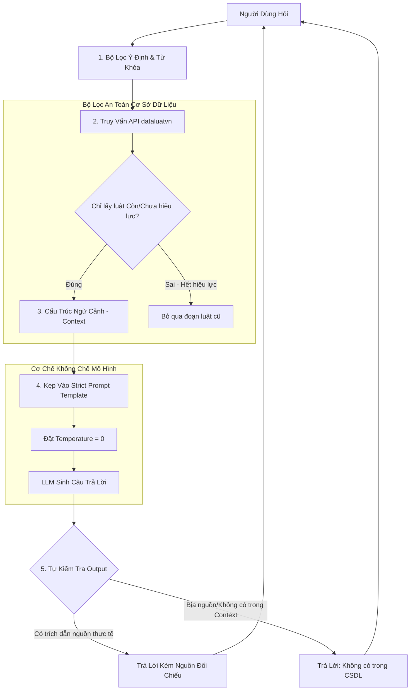

# 🛡️ Quy Trình Phòng Chống Ảo Giác (Bịa Luật) Trong RAG Pháp Luật

Tài liệu này chi tiết hóa quy trình, thiết kế kỹ thuật và các biện pháp bảo vệ (guardrails) nhằm ngăn chặn hoàn toàn hiện tượng **ảo giác (hallucination - tự bịa luật)** của Mô hình Ngôn ngữ Lớn (LLM) khi tích hợp chatbot RAG với cơ sở dữ liệu `dataluatvn`.

---

## 🗺️ Sơ Đồ Quy Trình Đối Chiếu & Kiểm Soát Ảo Giác



---

## 📌 PHẦN I: THIẾT KẾ CƠ SỞ DỮ LIỆU CHUẨN HOÁ (DATA-LEVEL GUARDRAILS)

Ngăn chặn ảo giác phải bắt đầu từ gốc dữ liệu sạch. Dữ liệu mập mờ hoặc phân đoạn sai chính là nguyên nhân hàng đầu khiến LLM suy diễn sai.

### 1. Phân mảnh theo Điều khoản (Semantic Chunking)
*   **Nguyên tắc:** Tuyệt đối không chia nhỏ văn bản pháp luật theo số lượng ký tự cố định (ví dụ: cứ 1000 ký tự cắt 1 đoạn). Việc này sẽ làm đứt gãy cấu trúc điều luật, khiến LLM mất ngữ cảnh hoặc ráp nối sai các khoản.
*   **Giải pháp:** Mỗi chunk (đoạn thông tin nhúng vector) bắt buộc phải là một **Điều luật hoàn chỉnh** (bao gồm tiêu đề Điều và toàn bộ nội dung các Khoản, Điểm chi tiết trực thuộc).
*   **Cấu trúc Context gửi lên LLM:**
    ```text
    ---
    [Nguồn: Luật Đất đai 2024 - Số hiệu: 31/2024/QH15]
    [Chương II: Quyền và Nghĩa vụ của Người sử dụng đất]
    Điều 26. Quyền chung của người sử dụng đất:
    1. Được cấp Giấy chứng nhận quyền sử dụng đất...
    2. Hưởng thành quả lao động, kết quả đầu tư trên đất...
    ---
    ```

### 2. Kiểm soát trạng thái hiệu lực văn bản
*   **Thực tế:** Nhiều hệ thống RAG lấy nhầm luật cũ đã hết hiệu lực dẫn đến LLM tư vấn sai.
*   **Giải pháp:** 
    *   Tận dụng cột `tinh_trang` trong cơ sở dữ liệu `vietnamese_legal_documents.db`.
    *   Chỉ truy vấn và nạp vào ngữ cảnh các văn bản có trạng thái: **`Còn hiệu lực`** hoặc **`Chưa có hiệu lực`**.
    *   Loại bỏ hoàn toàn các văn bản `Hết hiệu lực toàn bộ`. Đối với các văn bản `Hết hiệu lực một phần`, hệ thống sẽ gắn nhãn cảnh báo rõ ràng trong metadata.

### 3. Cập nhật gia tăng tức thời (Anti-Staleness)
*   Sử dụng script `sync_new_laws.py` chạy hàng đêm (00:00) để quét các văn bản mới trên VBPL.
*   Khi phát hiện văn bản mới thay thế văn bản cũ, hệ thống sẽ chuyển trạng thái của văn bản cũ sang `Hết hiệu lực` ngay lập tức để chatbot không bao giờ tham chiếu lại.

---

## 📌 PHẦN II: THIẾT KẾ PROMPT NGHIÊM NGẶT (PROMPT GUARDRAILS)

Prompt đóng vai trò như "hợp đồng pháp lý" ràng buộc hành vi của LLM, ép LLM chỉ được phát ngôn trong phạm vi dữ liệu được cung cấp.

### 1. System Prompt chống ảo giác mẫu
Dưới đây là cấu trúc System Prompt khuyến nghị áp dụng cho Backend Chatbot:

```text
Bạn là một trợ lý ảo tư vấn pháp luật Việt Nam thông thái, chính xác và cẩn trọng.
Nhiệm vụ của bạn là trả lời câu hỏi của người dùng bằng cách sử dụng các đoạn trích từ cơ sở dữ liệu pháp lý (được cung cấp trong phần "Ngữ cảnh pháp luật").

Tuân thủ nghiêm ngặt các quy tắc sau để tránh vi phạm pháp luật và ảo giác:
1. CHỈ SỬ DỤNG thông tin được cung cấp trực tiếp trong phần "Ngữ cảnh pháp luật". Tuyệt đối không tự suy diễn, bổ sung hoặc giả định bất kỳ điều luật nào không có trong ngữ cảnh.
2. Nếu câu hỏi của người dùng không thể được trả lời hoàn toàn từ Ngữ cảnh được cung cấp, bạn phải trả lời: "Tôi xin lỗi, thông tin pháp luật hiện tại trong cơ sở dữ liệu của tôi không đủ để trả lời chính xác câu hỏi này." và đề xuất người dùng cung cấp thêm thông tin hoặc liên hệ luật sư.
3. Mọi thông tin phản hồi phải trích dẫn rõ ràng nguồn gốc: Tên văn bản, Số hiệu, Điều mấy, Khoản mấy.
4. Tuyệt đối không sử dụng kiến thức bên ngoài (out-of-knowledge) của bạn để trả lời nếu nó mâu thuẫn hoặc không xuất hiện trong ngữ cảnh được cung cấp.
```

### 2. Định dạng Input/Output chuẩn
Khi gửi yêu cầu tới LLM, cấu trúc tin nhắn nên phân tách rõ ràng:

```text
[Ngữ cảnh pháp luật]
<Nạp các đoạn trích từ API dataluatvn tìm được tại đây>

[Câu hỏi người dùng]
<Câu hỏi thực tế>

[Câu trả lời của bạn]
```

---

## 📌 PHẦN III: THIẾT LẬP THAM SỐ LLM (API CONFIGURATION)

Khi cấu hình kết nối API của LLM (OpenAI, Gemini, Anthropic...), các tham số kỹ thuật cần được khóa chặt để loại bỏ tính ngẫu nhiên:

| Tham số | Giá trị khuyến nghị | Mục đích |
| :--- | :--- | :--- |
| **`temperature`** | **`0.0`** | Giảm thiểu tối đa độ sáng tạo của mô hình. Ép mô hình đưa ra câu trả lời mang tính logic và chính xác cao nhất. |
| **`top_p`** | **`0.1`** | Giới hạn việc chọn từ ngữ của mô hình trong nhóm các từ có xác suất cao nhất, tránh việc chọn từ ngẫu nhiên gây sai nghĩa thuật ngữ pháp lý. |
| **`max_tokens`** | **`2048`** (hoặc tùy chỉnh) | Đảm bảo câu trả lời không bị cắt cụt giữa chừng gây hiểu lầm. |

---

## 📌 PHẦN IV: HỆ THỐNG KIỂM TRA ĐẦU RA (POST-PROCESSING GUARDRAILS)

Kể cả khi đã thiết lập Prompt và Temperature tối ưu, vẫn cần một lớp kiểm tra sau khi LLM sinh câu trả lời trước khi gửi tới người dùng.

### 1. Kiểm tra chéo trích dẫn (Citation Validation)
*   **Cách hoạt động:** Viết một đoạn script Python nhỏ ở Backend để phân tích câu trả lời của LLM (dùng Regular Expression hoặc so khớp chuỗi).
*   **Logic:**
    *   Trích xuất tất cả các số hiệu văn bản pháp lý (Ví dụ: `12/2020/NĐ-CP`, `31/2024/QH15`) xuất hiện trong câu trả lời của LLM.
    *   Đối chiếu xem các số hiệu này có nằm trong danh sách các văn bản đã được nạp vào phần "Ngữ cảnh pháp luật" hay không.
    *   **Hành động:** Nếu LLM trích dẫn một số hiệu lạ hoắc không nằm trong ngữ cảnh nạp vào ban đầu, hệ thống sẽ đánh dấu câu trả lời này là **Ảo giác** và kích hoạt cơ chế trả lời thay thế (Fallback Answer).

### 2. Thiết lập Benchmark đánh giá định kỳ (Evaluation Framework)
Để đảm bảo các bản cập nhật hệ thống hoặc cập nhật prompt không gây ra ảo giác mới, cần chạy đánh giá tự động định kỳ:
*   **Tạo bộ Testset:** Chuẩn bị ít nhất 50 câu hỏi test thực tế kèm đáp án đúng (Ground Truth).
*   **Sử dụng thư viện Ragas (Retrieval Augmented Generation Assessment):**
    *   **Chỉ số `Faithfulness` (Độ trung thực):** Đo lường tỉ lệ phần trăm các câu khẳng định trong câu trả lời của LLM có thể được chứng minh trực tiếp từ ngữ cảnh tìm kiếm. Điểm số cần đạt: **> 0.95**.
    *   **Chỉ số `Answer Relevance` (Độ liên quan):** Đảm bảo LLM không đi lan man.
